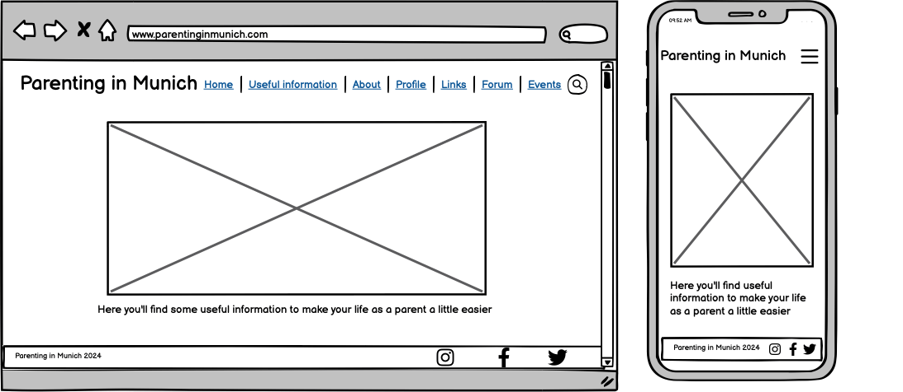
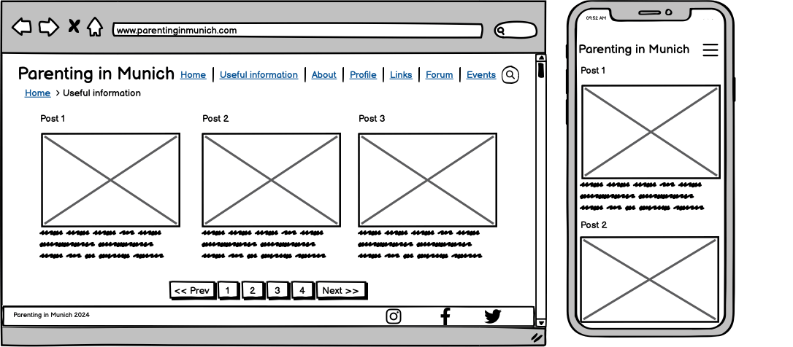
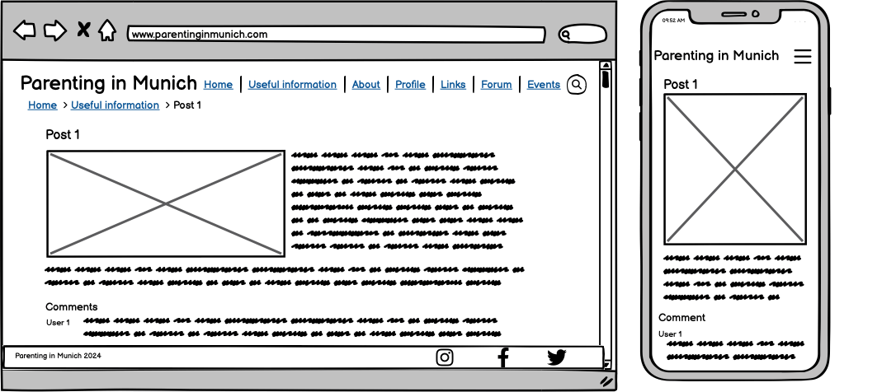
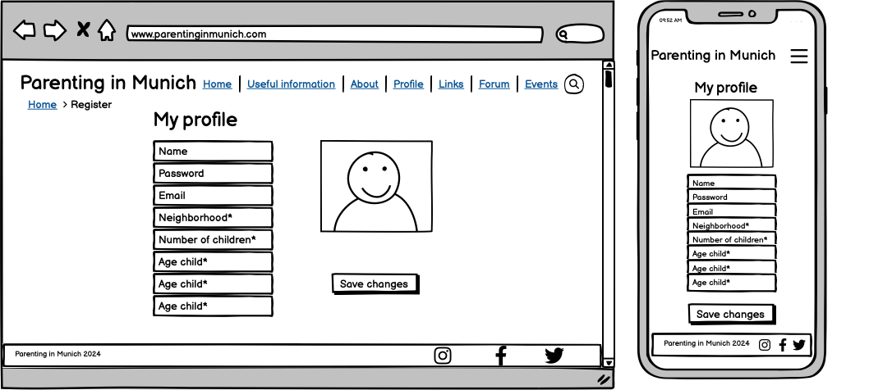
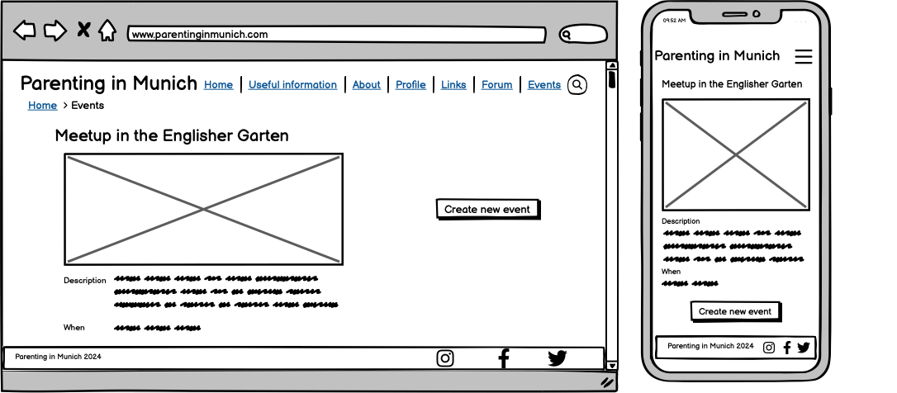
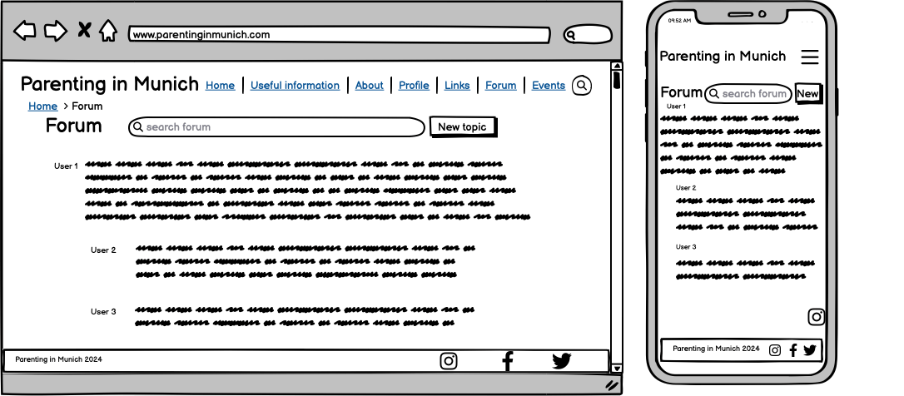
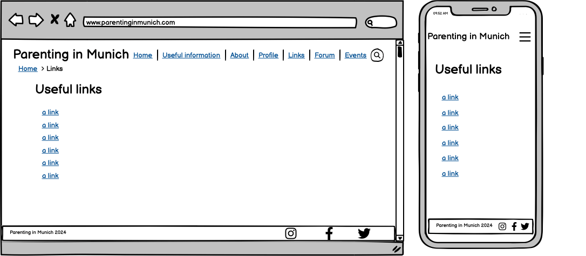
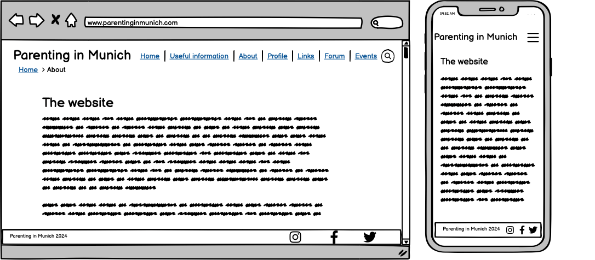
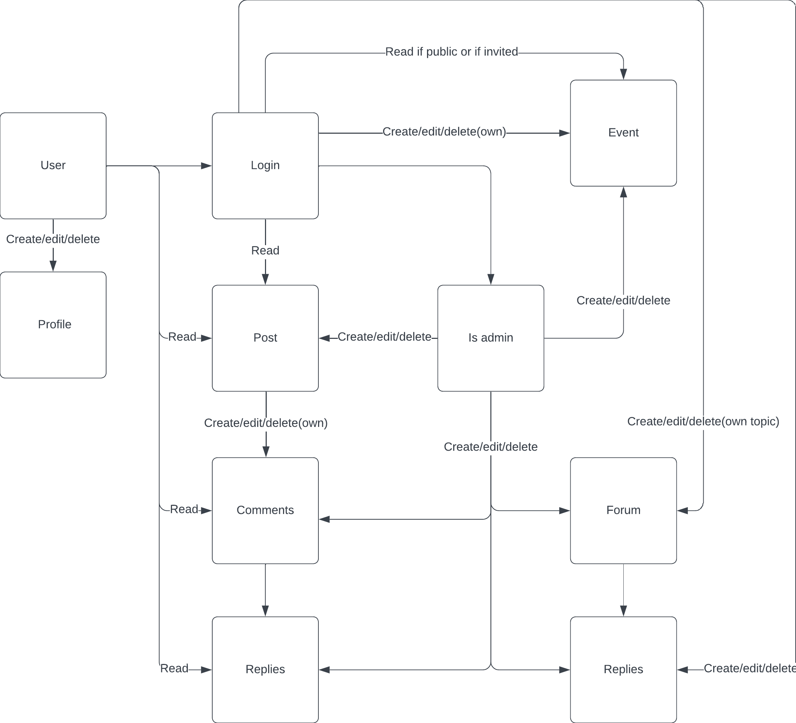

# Parenting in Munich

## Desing planning

### Wireframes

* Home page

* Posts page

* Posts detail page

* Registration page

* Events page

* Forum page

* Links page

* About page

### ERDs

* Simple interaction diagram

Validation tests using [The W3C Markup validation service](https://validator.w3.org/#validate_by_uri):
- [Homepage](https://validator.w3.org/nu/?showsource=yes&doc=https%3A%2F%2Fparenting-in-munich-site-527d6bb8b97c.herokuapp.com%2F#l265c52)
- [Posts All Categories](https://validator.w3.org/nu/?showsource=yes&doc=https%3A%2F%2Fparenting-in-munich-site-527d6bb8b97c.herokuapp.com%2Fposts%2F#l301c52)
(All 7 pages were tested. I only included the results of page 1 here.)
- [Post Specific Category - Pregnancy and Birth](https://validator.w3.org/nu/?showsource=yes&doc=https%3A%2F%2Fparenting-in-munich-site-527d6bb8b97c.herokuapp.com%2Fposts%2Fcategory%2Fpregnancy-and-birth%2F#l301c52)
- [Post Specific Category - Parenting Advice](https://validator.w3.org/nu/?showsource=yes&doc=https%3A%2F%2Fparenting-in-munich-site-527d6bb8b97c.herokuapp.com%2Fposts%2Fcategory%2Fparenting-advice%2F#l301c52)
- [Post Specific Category - Nutrition](https://validator.w3.org/nu/?showsource=yes&doc=https%3A%2F%2Fparenting-in-munich-site-527d6bb8b97c.herokuapp.com%2Fposts%2Fcategory%2Fnutrition%2F#l301c52)
- [Post Specific Category - Education and Development](https://validator.w3.org/nu/?showsource=yes&doc=https%3A%2F%2Fparenting-in-munich-site-527d6bb8b97c.herokuapp.com%2Fposts%2Fcategory%2Feducation-and-development%2F#l301c52)
- [Post Specific Category - Cultural Traditions](https://validator.w3.org/nu/?showsource=yes&doc=https%3A%2F%2Fparenting-in-munich-site-527d6bb8b97c.herokuapp.com%2Fposts%2Fcategory%2Fcultural-traditions%2F#l301c52)
- [Post Specific Category - Bullying](https://validator.w3.org/nu/?showsource=yes&doc=https%3A%2F%2Fparenting-in-munich-site-527d6bb8b97c.herokuapp.com%2Fposts%2Fcategory%2Fbullying%2F#l301c52)
- [Post Specific Category - Childcare](https://validator.w3.org/nu/?showsource=yes&doc=https%3A%2F%2Fparenting-in-munich-site-527d6bb8b97c.herokuapp.com%2Fposts%2Fcategory%2Fchildcare%2F#l301c52)
- [Post Specific Category - Legal and Administrative Processes](https://validator.w3.org/nu/?showsource=yes&doc=https%3A%2F%2Fparenting-in-munich-site-527d6bb8b97c.herokuapp.com%2Fposts%2Fcategory%2Flegal-and-administrative-processes%2F#l301c52)
- [Post Specific Category - Healthcare](https://validator.w3.org/nu/?showsource=yes&doc=https%3A%2F%2Fparenting-in-munich-site-527d6bb8b97c.herokuapp.com%2Fposts%2Fcategory%2Fhealthcare%2F#l301c52)
- [Post Detail - Specific Post](https://validator.w3.org/nu/?showsource=yes&doc=https%3A%2F%2Fparenting-in-munich-site-527d6bb8b97c.herokuapp.com%2Fposts%2Fdo-pregnant-women-and-new-mothers-need-a-hebamme-exploring-the-role-of-midwives-in-germany%2F#l301c52)(All 37 posts were tested, I have only included the result for the test on the "Do Pregnant Women and New Mothers Need a Hebamme? Exploring the Role of Midwives in Germany" here.)
- [About] 

