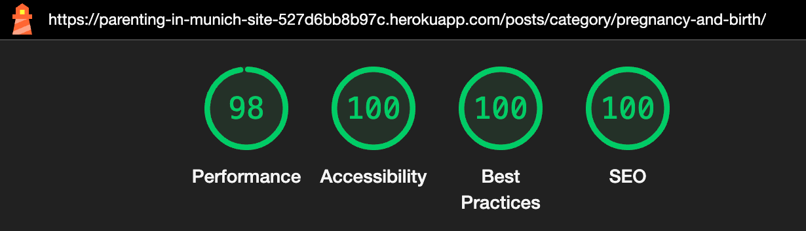
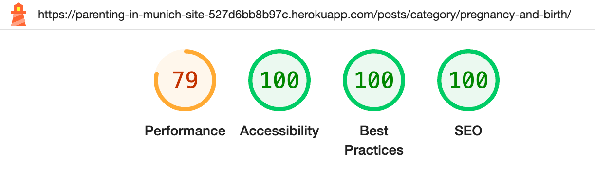
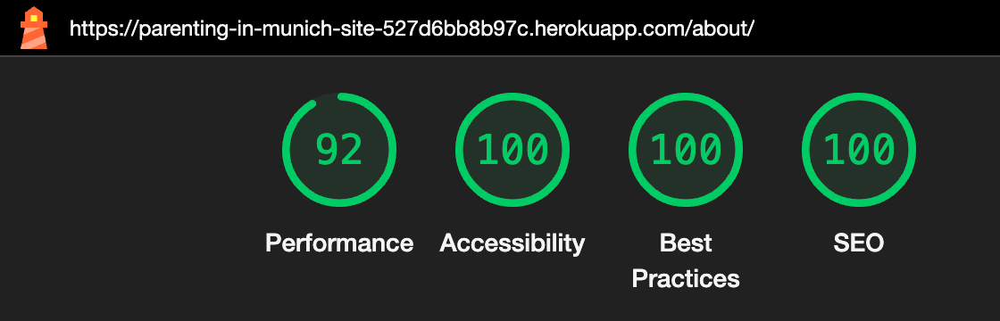
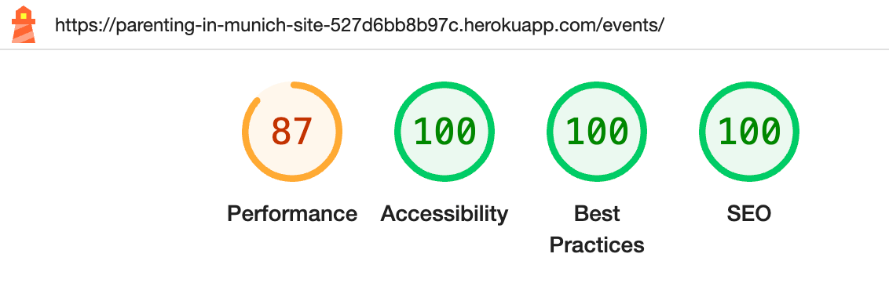
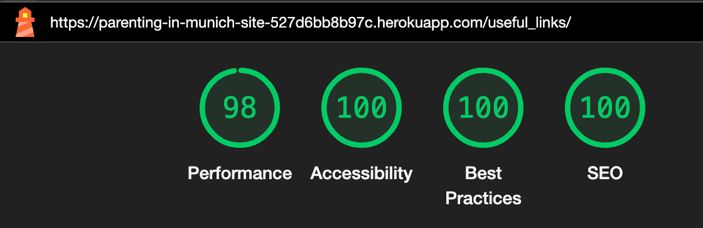
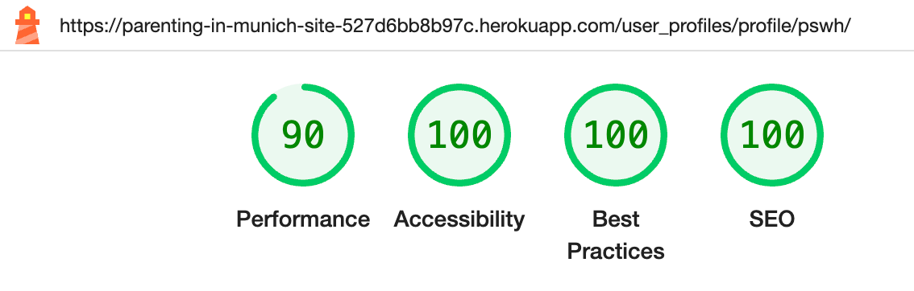

# Parenting in Munich

## Desing planning

### Wireframes

* Home page

* Posts page

* Posts detail page

* Registration page

* Events page

* Forum page

* Links page

* About page

### ERDs

* Simple interaction diagram

### Validation tests using [The W3C Markup validation service](https://validator.w3.org/#validate_by_uri):
- [Homepage](https://validator.w3.org/nu/?showsource=yes&doc=https%3A%2F%2Fparenting-in-munich-site-527d6bb8b97c.herokuapp.com%2F#l265c52)
- [Posts All Categories](https://validator.w3.org/nu/?showsource=yes&doc=https%3A%2F%2Fparenting-in-munich-site-527d6bb8b97c.herokuapp.com%2Fposts%2F#l301c52)
(All 7 pages were tested. I only included the results of page 1 here.)
- [Post Specific Category - Pregnancy and Birth](https://validator.w3.org/nu/?showsource=yes&doc=https%3A%2F%2Fparenting-in-munich-site-527d6bb8b97c.herokuapp.com%2Fposts%2Fcategory%2Fpregnancy-and-birth%2F#l301c52)
- [Post Specific Category - Parenting Advice](https://validator.w3.org/nu/?showsource=yes&doc=https%3A%2F%2Fparenting-in-munich-site-527d6bb8b97c.herokuapp.com%2Fposts%2Fcategory%2Fparenting-advice%2F#l301c52)
- [Post Specific Category - Nutrition](https://validator.w3.org/nu/?showsource=yes&doc=https%3A%2F%2Fparenting-in-munich-site-527d6bb8b97c.herokuapp.com%2Fposts%2Fcategory%2Fnutrition%2F#l301c52)
- [Post Specific Category - Education and Development](https://validator.w3.org/nu/?showsource=yes&doc=https%3A%2F%2Fparenting-in-munich-site-527d6bb8b97c.herokuapp.com%2Fposts%2Fcategory%2Feducation-and-development%2F#l301c52)
- [Post Specific Category - Cultural Traditions](https://validator.w3.org/nu/?showsource=yes&doc=https%3A%2F%2Fparenting-in-munich-site-527d6bb8b97c.herokuapp.com%2Fposts%2Fcategory%2Fcultural-traditions%2F#l301c52)
- [Post Specific Category - Bullying](https://validator.w3.org/nu/?showsource=yes&doc=https%3A%2F%2Fparenting-in-munich-site-527d6bb8b97c.herokuapp.com%2Fposts%2Fcategory%2Fbullying%2F#l301c52)
- [Post Specific Category - Childcare](https://validator.w3.org/nu/?showsource=yes&doc=https%3A%2F%2Fparenting-in-munich-site-527d6bb8b97c.herokuapp.com%2Fposts%2Fcategory%2Fchildcare%2F#l301c52)
- [Post Specific Category - Legal and Administrative Processes](https://validator.w3.org/nu/?showsource=yes&doc=https%3A%2F%2Fparenting-in-munich-site-527d6bb8b97c.herokuapp.com%2Fposts%2Fcategory%2Flegal-and-administrative-processes%2F#l301c52)
- [Post Specific Category - Healthcare](https://validator.w3.org/nu/?showsource=yes&doc=https%3A%2F%2Fparenting-in-munich-site-527d6bb8b97c.herokuapp.com%2Fposts%2Fcategory%2Fhealthcare%2F#l301c52)
- [Post Detail - Specific Post](https://validator.w3.org/nu/?showsource=yes&doc=https%3A%2F%2Fparenting-in-munich-site-527d6bb8b97c.herokuapp.com%2Fposts%2Fdo-pregnant-women-and-new-mothers-need-a-hebamme-exploring-the-role-of-midwives-in-germany%2F#l301c52)(All 37 posts were tested, I have only included the result for the test on the "Do Pregnant Women and New Mothers Need a Hebamme? Exploring the Role of Midwives in Germany" here.)
- [About page](https://validator.w3.org/nu/?showsource=yes&doc=https%3A%2F%2Fparenting-in-munich-site-527d6bb8b97c.herokuapp.com%2Fabout%2F#l295c177)
- [Events page](https://validator.w3.org/nu/?showsource=yes&doc=https%3A%2F%2Fparenting-in-munich-site-527d6bb8b97c.herokuapp.com%2Fevents%2Frestricted-area%2F%3Fnext%3D%2Fevents%2F#l295c177)
- [Useful links](https://validator.w3.org/nu/?showsource=yes&doc=https%3A%2F%2Fparenting-in-munich-site-527d6bb8b97c.herokuapp.com%2Fuseful_links%2F)
- [Login page](https://validator.w3.org/nu/?showsource=yes&doc=https%3A%2F%2Fparenting-in-munich-site-527d6bb8b97c.herokuapp.com%2Faccounts%2Flogin%2F)
- [Signup page](https://validator.w3.org/nu/?showsource=yes&doc=https%3A%2F%2Fparenting-in-munich-site-527d6bb8b97c.herokuapp.com%2Faccounts%2Fsignup%2F)

All pages with authenticated user and page 404 were tested by pasting the source code from the rendered page and also showed no error nor warnings.

---

### CSS validation was done using [W3C CSS Validator](https://jigsaw.w3.org/css-validator/validator?uri=https%3A%2F%2Fparenting-in-munich-site-527d6bb8b97c.herokuapp.com%2F&profile=css3svg&usermedium=all&warning=1&vextwarning=&lang=en)
- [CSS validation](https://jigsaw.w3.org/css-validator/validator?uri=https%3A%2F%2Fparenting-in-munich-site-527d6bb8b97c.herokuapp.com%2F&profile=css3svg&usermedium=all&warning=1&vextwarning=&lang=en)

---

### Lighthouse tests results:

white background: mobile
black background: desktop

- Homepage:

- Posts - All categories page:

- Post - Category specific page:

- Post detail page:

- About page:

- Events page:

- Events restricted area page:

- Useful links page:

- Signup page:

- Login page:

- User Profile page:

- Profile Update page:

- Logout page:

--- 

### Responsiveness test:

The resposiveness amongts different devices was checked using [Am I Responsive](https://ui.dev/amiresponsive).
To perform the testing, it was necessary to adjust the `X_FRAME_OPTIONS` to `ALLOWALL` temporarily on settings.py and change back to `SAMEORIGIN` as soon as the test was finished for security reasons.

- Homepage:

- Posts page:

- Post detail page:

- About page:

- Events restricted area page:

- Useful links page:

- Signup page:

- Login page:

* The Events, User Profile, Profile Update and Logout pages could not be tested on the website because the login doesn't work during the testing, but they were manually tested in different devices and are responsive as well.

