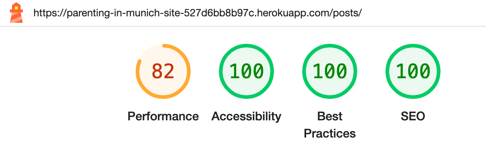
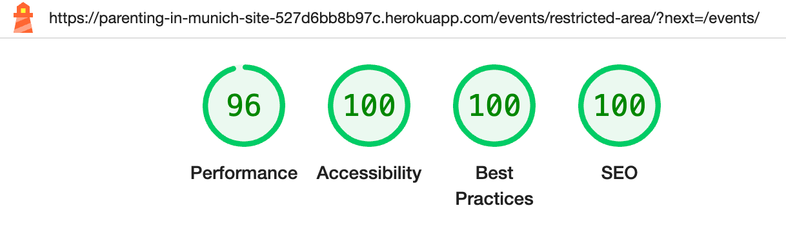
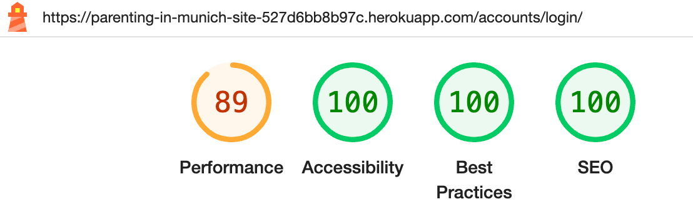
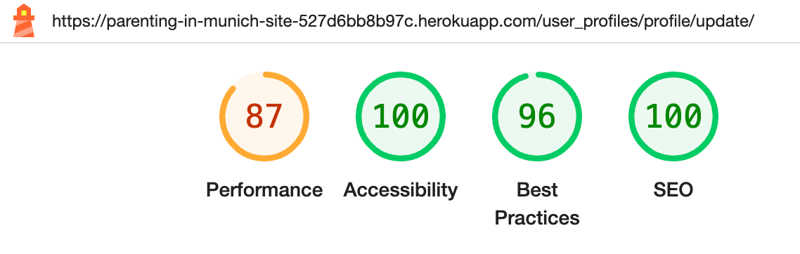

# Parenting in Munich

When I was expecting my first son as an expat in Germany, I felt lost and struggled to find information. Without family nearby, I relied on advice from others and spent a lot of time searching for resources. Thankfully, I connected with other mums in similar situations, and together, we formed a community to support each other by exchanging information.

Inspired by this experience, I created this website to provide the useful information I wished I had as a new parent in Munich. "Parenting in Munich" is designed to help new and expecting parents with parenting tips, health, education, and bureaucratic information.

The deployed website can be visited [here](https://parenting-in-munich-site-527d6bb8b97c.herokuapp.com/)

---

## Features

### Existing Features

#### Home Page

##### Hero Section
The home page welcomes users based on their authentication status, offering different content and links accordingly:
- For Admin Users there is a personalized welcome message for admins and access to the admin panel.
- For Authenticated Users tehre is a personalized welcome message and links to explore posts and events.
- For Unauthenticated Users tehre is a general welcome message and a link to sign up.

Hero image with general message for visitors:

##### Navigation Menu

The navigation bar provides users with easy access to various sections of the site, ensuring a smooth and intuitive browsing experience including a responsive design with a toggle butto for small screens, enabling the collapse and expansion of the navigation menu.

  - Clickable logo that redirects to the home page.
  - Navigation Links (highlighted when active):
    - Home: Navigation link to the home page
    - Posts: 
     - Dropdown menu listing all categories.
     - Direct link to all posts.
    - About: Link to the About page.
    - Events: Link to the Events page.
    - Useful Links: Direct link to the Useful Links page.
    - Authentication Links:
      - Logged-in Users:
        - Admin Panel (displayed only for admin users): Link to the admin panel for staff.
        - Profile: Link to the user's profile page.
        - Logout: Link to log out.
      - Logged-out Users:
        - Sign Up: Link to the sign-up page.
        - Login: Link to the login page.

[Navbar](documentation/features/navbar.png)

  - Search Functionality:
   - Search form displayed only on the Posts page for searching posts.

[Navbar - posts section](documentation/features/navbar-posts.png)

## Design

### Layout

The website's layout was inspired on the [Bootstrap Theme Milo](https://themes.getbootstrap.com/product/milo-magazineblog-theme/), and this layout was consistently applied throughout the entire site ensuring a cohesive and professional appearance, enhancing user experience and navigation.

### Colour Scheme

The chosen color palette is a monochromatic scheme designed to create a visually appealing and user-friendly interface while ensuring compatibility with the diverse images featured in the blog posts. The white (#fff) and off-white background (#f2f2f2) provides a clean, open canvas that promotes clarity and focus on the content. For the text, black (#000) and dark gray (#424242) have been used to ensure strong readability. These darker shades create a professional contrast against the white background, making the text stand out clearly. The choice of this monochromatic palette of neutral colors avoids any clash with the varied imagery on the site, maintaining visual harmony and a cohesive user experience.

  

### Typography

- Google Fonts were utilized to import the selected fonts for use on the website.

- [PT Sans Caption](https://fonts.google.com/specimen/PT+Sans+Caption?query=PT+Sans+cap) was used for the body text whereas [EB Garamond](https://fonts.google.com/specimen/EB+Garamond?query=EB+Garamond) was used for the headings. This combination was chosen to balance aesthetic appeal and readability. EB Garamond, a serif typeface, provides a touch of elegance, making it ideal for headings. For the main content, PT Sans Caption offers a modern, clean look that ensures high legibility across various devices. Its sans-serif design contrasts well with the traditional serif of EB Garamond, creating a balanced and accessible user experience.

- As the fallback, serif was chosen for the headings as a browser-safe font, in combination with sans-serif for the body text, following the same stylistic approach as the chosen fonts.

EB Garamond example: 

PT Sans Caption example:

## Desing planning

### Wireframes

* Home page

* Posts page

* Posts detail page

* Registration page

* Events page

* Forum page

* Links page

* About page

### ERDs

* Simple interaction diagram

## Code Style and Quality

### Python Enhancement Proposal (PEP8)

PEP8 outlines the conventions for writing clean, readable, and maintainable Python code. Adhering to these guidelines helps ensure that the codebase remains consistent and understandable for all contributors.
All Python code in this project has been checked and verified for adherence to the PEP8 style guide using the extension [Flake8](https://flake8.pycqa.org/en/latest/) on [VSCode](https://code.visualstudio.com/) and double checked using the [CI PEP8 linter](https://pep8ci.herokuapp.com/).

### HTML Validation tests

HTML Validation tests were performed using the [W3C Markup validation service](https://validator.w3.org/#validate_by_uri):

- [Homepage](https://validator.w3.org/nu/?showsource=yes&doc=https%3A%2F%2Fparenting-in-munich-site-527d6bb8b97c.herokuapp.com%2F#l265c52)
- [Posts All Categories](https://validator.w3.org/nu/?showsource=yes&doc=https%3A%2F%2Fparenting-in-munich-site-527d6bb8b97c.herokuapp.com%2Fposts%2F#l301c52)
- [Post Specific Category - Pregnancy and Birth](https://validator.w3.org/nu/?showsource=yes&doc=https%3A%2F%2Fparenting-in-munich-site-527d6bb8b97c.herokuapp.com%2Fposts%2Fcategory%2Fpregnancy-and-birth%2F#l301c52)
- [Post Specific Category - Parenting Advice](https://validator.w3.org/nu/?showsource=yes&doc=https%3A%2F%2Fparenting-in-munich-site-527d6bb8b97c.herokuapp.com%2Fposts%2Fcategory%2Fparenting-advice%2F#l301c52)
- [Post Specific Category - Nutrition](https://validator.w3.org/nu/?showsource=yes&doc=https%3A%2F%2Fparenting-in-munich-site-527d6bb8b97c.herokuapp.com%2Fposts%2Fcategory%2Fnutrition%2F#l301c52)
- [Post Specific Category - Education and Development](https://validator.w3.org/nu/?showsource=yes&doc=https%3A%2F%2Fparenting-in-munich-site-527d6bb8b97c.herokuapp.com%2Fposts%2Fcategory%2Feducation-and-development%2F#l301c52)
- [Post Specific Category - Cultural Traditions](https://validator.w3.org/nu/?showsource=yes&doc=https%3A%2F%2Fparenting-in-munich-site-527d6bb8b97c.herokuapp.com%2Fposts%2Fcategory%2Fcultural-traditions%2F#l301c52)
- [Post Specific Category - Bullying](https://validator.w3.org/nu/?showsource=yes&doc=https%3A%2F%2Fparenting-in-munich-site-527d6bb8b97c.herokuapp.com%2Fposts%2Fcategory%2Fbullying%2F#l301c52)
- [Post Specific Category - Childcare](https://validator.w3.org/nu/?showsource=yes&doc=https%3A%2F%2Fparenting-in-munich-site-527d6bb8b97c.herokuapp.com%2Fposts%2Fcategory%2Fchildcare%2F#l301c52)
- [Post Specific Category - Legal and Administrative Processes](https://validator.w3.org/nu/?showsource=yes&doc=https%3A%2F%2Fparenting-in-munich-site-527d6bb8b97c.herokuapp.com%2Fposts%2Fcategory%2Flegal-and-administrative-processes%2F#l301c52)
- [Post Specific Category - Healthcare](https://validator.w3.org/nu/?showsource=yes&doc=https%3A%2F%2Fparenting-in-munich-site-527d6bb8b97c.herokuapp.com%2Fposts%2Fcategory%2Fhealthcare%2F#l301c52)
- [Post Detail - Specific Post](https://validator.w3.org/nu/?showsource=yes&doc=https%3A%2F%2Fparenting-in-munich-site-527d6bb8b97c.herokuapp.com%2Fposts%2Fdo-pregnant-women-and-new-mothers-need-a-hebamme-exploring-the-role-of-midwives-in-germany%2F#l301c52)
- [About page](https://validator.w3.org/nu/?showsource=yes&doc=https%3A%2F%2Fparenting-in-munich-site-527d6bb8b97c.herokuapp.com%2Fabout%2F#l295c177)
- [Events page](https://validator.w3.org/nu/?showsource=yes&doc=https%3A%2F%2Fparenting-in-munich-site-527d6bb8b97c.herokuapp.com%2Fevents%2Frestricted-area%2F%3Fnext%3D%2Fevents%2F#l295c177)
- [Useful links](https://validator.w3.org/nu/?showsource=yes&doc=https%3A%2F%2Fparenting-in-munich-site-527d6bb8b97c.herokuapp.com%2Fuseful_links%2F)
- [Login page](https://validator.w3.org/nu/?showsource=yes&doc=https%3A%2F%2Fparenting-in-munich-site-527d6bb8b97c.herokuapp.com%2Faccounts%2Flogin%2F)
- [Signup page](https://validator.w3.org/nu/?showsource=yes&doc=https%3A%2F%2Fparenting-in-munich-site-527d6bb8b97c.herokuapp.com%2Faccounts%2Fsignup%2F)

**Notes**
 - All 7 pages of Posts (All Categories) were tested. I only included the results of page 1 here for illustration purpose.

 - All 37 posts were individually tested, I have only included the result for the test on the "Do Pregnant Women and New Mothers Need a Hebamme? Exploring the Role of Midwives in Germany" here for illustration purpose.

 - All pages with authenticated user and page 404 were tested by pasting the source code from the rendered page and also passed with no error nor warnings.

---

### CSS validation was done using [W3C CSS Validator](https://jigsaw.w3.org/css-validator/validator?uri=https%3A%2F%2Fparenting-in-munich-site-527d6bb8b97c.herokuapp.com%2F&profile=css3svg&usermedium=all&warning=1&vextwarning=&lang=en)
- [CSS validation](https://jigsaw.w3.org/css-validator/validator?uri=https%3A%2F%2Fparenting-in-munich-site-527d6bb8b97c.herokuapp.com%2F&profile=css3svg&usermedium=all&warning=1&vextwarning=&lang=en)

---

### Lighthouse tests results:

white background: mobile
black background: desktop

- Homepage:

- Posts - All categories page:

- Post - Category specific page:

- Post detail page:

- About page:

- Events page:

- Events restricted area page:

- Useful links page:

- Signup page:

- Login page:

- User Profile page:

- Profile Update page:

- Logout page:

--- 

### Responsiveness test:

The resposiveness amongts different devices was checked using [Am I Responsive](https://ui.dev/amiresponsive).
To perform the testing, it was necessary to adjust the `X_FRAME_OPTIONS` to `ALLOWALL` temporarily on settings.py and change back to `SAMEORIGIN` as soon as the test was finished for security reasons.

- Homepage:

- Posts page:

- Post detail page:

- About page:

- Events restricted area page:

- Useful links page:

- Signup page:

- Login page:

* The Events, User Profile, Profile Update and Logout pages could not be tested on the website because the login doesn't work during the testing, but they were manually tested in different devices and are responsive as well.

