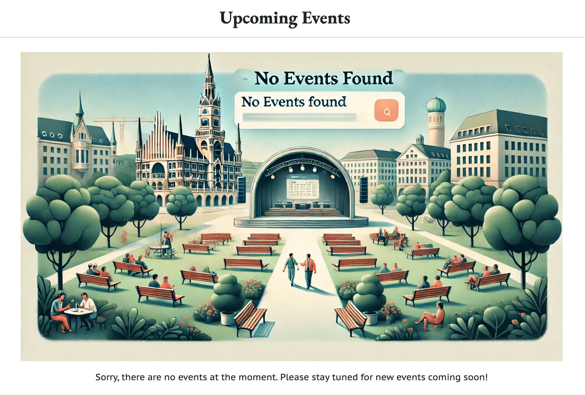
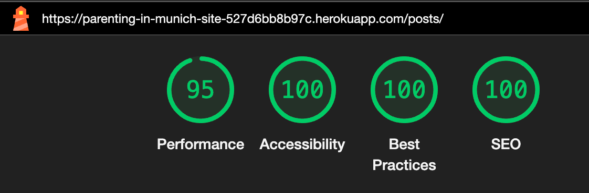
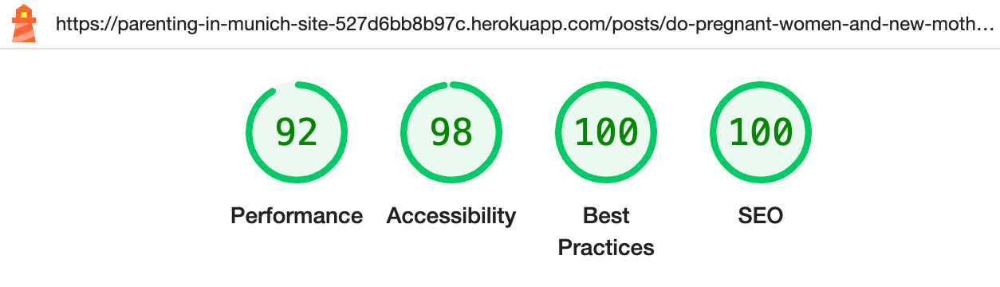
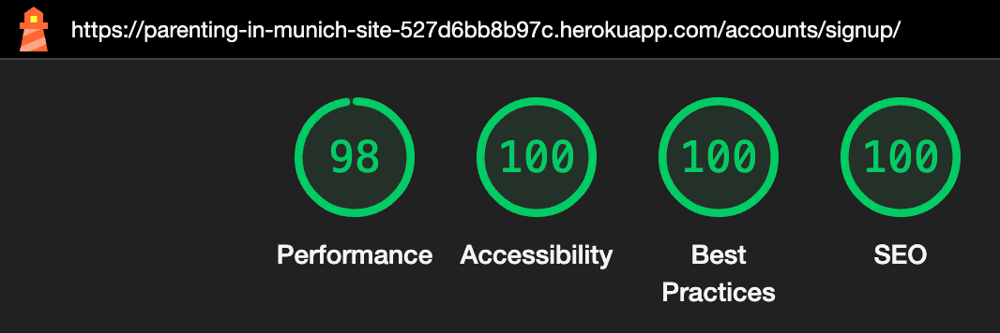
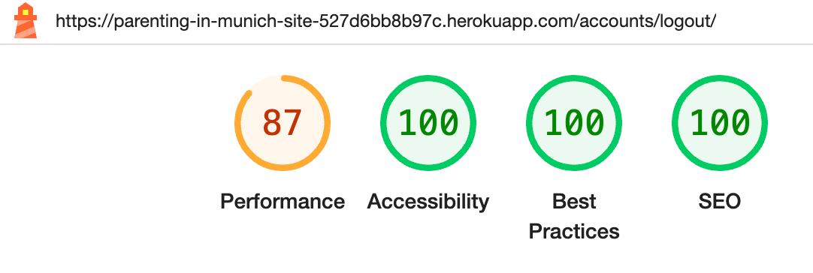
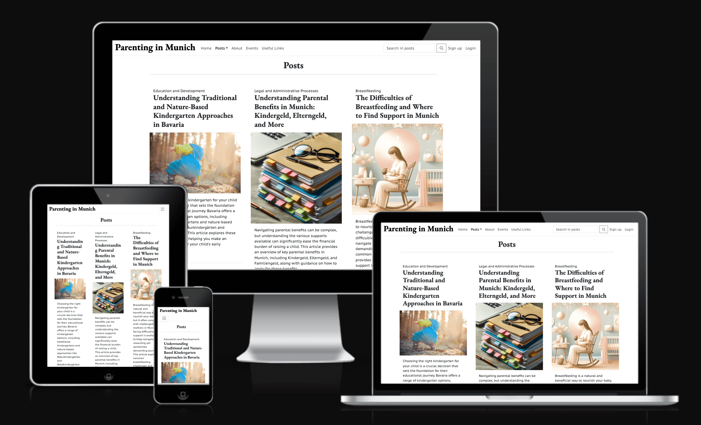
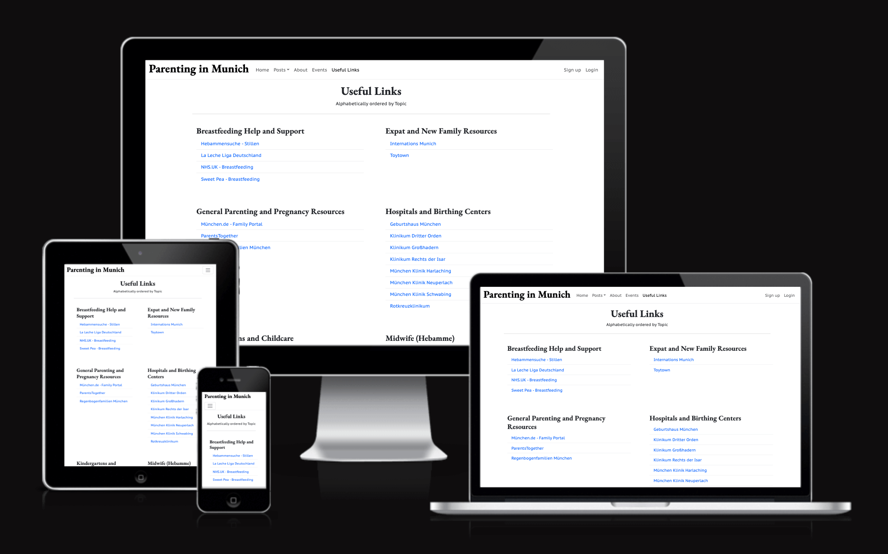
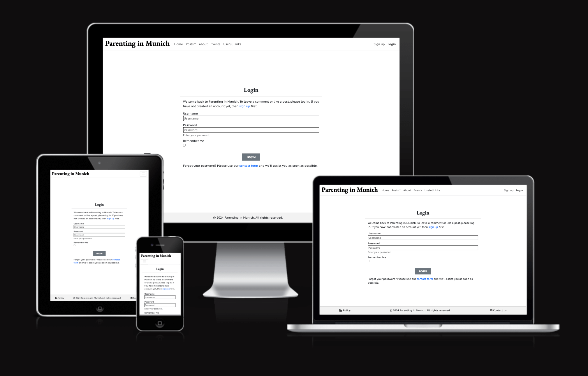

# Parenting in Munich

When I was expecting my first son as an expat in Germany, I felt lost and struggled to find information. Without family nearby, I relied on advice from others and spent a lot of time searching for resources. Thankfully, I connected with other mums in similar situations, and together, we formed a community to support each other by exchanging information.

Inspired by this experience, I created this website to provide the useful information I wished I had as a new parent in Munich. "Parenting in Munich" is designed to help new and expecting parents with parenting tips, health, education, and bureaucratic information.

The deployed website can be visited [here](https://parenting-in-munich-site-527d6bb8b97c.herokuapp.com/)

---

## Features

### Existing Features

#### Home Page

##### Hero Section
The home page welcomes users based on their authentication status, offering different content and links accordingly:
- For admin users there is a personalized welcome message for admins and access to the admin panel.
- For authenticated users tehre is a personalized welcome message and links to explore posts and events.
- For unauthenticated users tehre is a general welcome message and a link to sign up.

Hero image with general message for visitors:

#### Navigation Menu

The navigation bar provides users with easy access to various sections of the site, ensuring a smooth and intuitive browsing experience including a responsive design with a toggle butto for small screens, enabling the collapse and expansion of the navigation menu.

The navigation bar includes:
  - A clickable logo that redirects to the home page.
  - Navigation links (highlighted when active) to:
    - Home: navigation link to the home page
    - Posts: dropdown menu listing all categories as well as a direct link to all posts.
    - About: link to the About page.
    - Events: link to the Events page.
    - Useful links: direct link to the Useful Links page.
    - Authentication Links:
      - For logged-in users:
        - Admin Panel (displayed only for admin users): Link to the admin panel for staff.
        - Profile: Link to the user's profile page.
        - Logout: Link to log out.
      - For logged-out users:
        - Sign Up: Link to the sign-up page.
        - Login: Link to the login page.

Navbar view for general visitors:

Navbar view for admin users:

Navbar view for authenticated users with no admin rights:

**Search Functionality**

Because the search engine is specifically designed for finding posts, the search field is only displayed on the Posts page.

Navbar view for visitors on the posts page:

---

### Posts and Posts by category pages

Both pages allow users to browse, search, and explore various articles on parenting topics. They dynamically display posts based on user searches and include pagination for easy navigation.

#### Content Display

**Post Cards:**
  - Each post is displayed in a card format with the following elements:
    - **Category Link:** Displays the category of the post, linking to other posts in the same category.
    - **Title:** Clickable link to the full post details.
    - **Featured Image:** Displays the post's featured image or a placeholder if none is provided.
    - **Excerpt:** A brief summary of the post content.

#### Search feature:

Searches for posts containig the entered word and displays the result message "Search results for [word of interest]" or display a message informing the user that no posts have matched the search query and provides a link to return to all posts.

Search results without a match:

Search results with matching results:

#### Responsive Design:
The post cards are dynamically generated and displayed 6 per page. Because the cards have different sizes, on medium and large screens, they are arranged in organized columns and rows. The default layout creates a new column every two posts, allowing them to stack on top of each other and giving the page a sense of continuity rather than a fixed grid. If there are up to three posts, they will be displayed side by side for a better user experience. The width of the columns remains 1/3, even if there are only one or two posts, to maintain consistency between different pages.

Content display:

#### Pagination:

If there are more than 6 posts to be displayed, pagination navigation controls are included, allowing users to navigate between pages of posts.

The pagination changes dynamically, showing page numbers within a range around the current page, along with links to the previous and next pages of posts, and direct links to the first and last pages when appropriate.

On small screens, such as mobile phones, the pagination omits the buttons for the previous and next pages to better accommodate the controls on the limited screen size while still allowing easy navigation throughout the entire content.

Pagination Comparison: Computer Screen vs. Phone Screen:

---

### Post Detail Page

The Post Detail page displays the full content of a specific post, along with a comment section for user interactions.

#### Link to Category

On the post detail page, a link to the post's category is provided. When clicked, this link takes the user directly to the category page, which includes other posts in that same category.

Link to category:

#### Comments Section

The comments section displays the number of comments and allows authenticated users to submit comments.
- Authenticated users can see all approved comments and see, delete or edit their own comments, even the pending aproval ones.
- Approved comments have a link to the comment's author profile.
- Unauthenticated users are prompt to log in or sign up to participate in discussions.

##### Comments from deleted accounts

If a user has left a comment and deleted their account or had their account deleted, their comments will remain on the posts unless they themselves deleted the comments, or the comments were not approved or were deleted for inappropriate content. In such cases, the username will be followed by a "Deactivated" mention to indicate that the user is no longer a registered member of the website, thus preserving the integrity of the history and discussions. There will be no link to the profile, and the profile photo thumbnail will be displayed with a fainted image of the placeholder image for the profile.

The reasoning for keeping comments upon account termination is explained in the website rules that users must agree to upon signing up. This information is also explicitly provided when a user terminates their account.

Comment's author view of the comments with edit and delete options:

Overview of the comments section including comment from deleted account's author:

#### Comments deletion

Users can delete their own comments and will be asked to confirm their decision before the permanent deletion.

Confirmation prior to deletion:

### About Us Page

The "About Us" page provides information about the website, its mission, and a way for users to get in touch.

#### Contact Us Section

Users are invited to reach out with feedback, questions, or suggestions

### Events Page

The Events page is exclusively for registered users and showcases upcoming family-oriented events, providing detailed information about each event.

#### Content Display

The events are displayed in a similar way to the posts to keep consistancy thoughout the website. 

- Event Card Structure:
     - Event Image: Displays the event's image.
     - Event Name: Title of the event.
     - Description: Detailed information about the event.
     - Location: Venue of the event.
     - Date: Start and end dates of the event.
     - Time: Start and end times of the event. If only start time is provided, the time is displayed as "from 'hours'"
     - Website Link: (Optional) Link to the event's website.

The page is programmed to order the events by start date, displaying the closest ones first. It also automatically filters out events that have an end date earlier than the current date.

Events page layout:

* The content observed on the live site may differ due to the filtering passed events feature. Screenshot taken on June 22nd 2024

If there are no events to be displayed the page, a friendly iamge and message are displayed.

If tehre are no events to be displayed:

#### Restricted Area

Unauthorized users are promt to register in order to see the events.

## Design

### Layout

The website's layout was inspired on the [Bootstrap Theme Milo](https://themes.getbootstrap.com/product/milo-magazineblog-theme/), and this layout was consistently applied throughout the entire site ensuring a cohesive and professional appearance, enhancing user experience and navigation.

### Colour Scheme

The chosen color palette is a monochromatic scheme designed to create a visually appealing and user-friendly interface while ensuring compatibility with the diverse images featured in the blog posts. The white (#fff) and off-white background (#f2f2f2) provides a clean, open canvas that promotes clarity and focus on the content. For the text, black (#000) and dark gray (#424242) have been used to ensure strong readability. These darker shades create a professional contrast against the white background, making the text stand out clearly. The choice of this monochromatic palette of neutral colors avoids any clash with the varied imagery on the site, maintaining visual harmony and a cohesive user experience.

  

### Typography

- Google Fonts were utilized to import the selected fonts for use on the website.

- [PT Sans Caption](https://fonts.google.com/specimen/PT+Sans+Caption?query=PT+Sans+cap) was used for the body text whereas [EB Garamond](https://fonts.google.com/specimen/EB+Garamond?query=EB+Garamond) was used for the headings. This combination was chosen to balance aesthetic appeal and readability. EB Garamond, a serif typeface, provides a touch of elegance, making it ideal for headings. For the main content, PT Sans Caption offers a modern, clean look that ensures high legibility across various devices. Its sans-serif design contrasts well with the traditional serif of EB Garamond, creating a balanced and accessible user experience.

- As the fallback, serif was chosen for the headings as a browser-safe font, in combination with sans-serif for the body text, following the same stylistic approach as the chosen fonts.

EB Garamond example: 

PT Sans Caption example:

## Desing planning

### Wireframes

* Home page

* Posts page

* Posts detail page

* Registration page

* Events page

* Forum page

* Links page

* About page

### ERDs

* Simple interaction diagram

## Code Style and Quality

### Python Enhancement Proposal (PEP8)

PEP8 outlines the conventions for writing clean, readable, and maintainable Python code. Adhering to these guidelines helps ensure that the codebase remains consistent and understandable for all contributors.
All Python code in this project has been checked and verified for adherence to the PEP8 style guide using the extension [Flake8](https://flake8.pycqa.org/en/latest/) on [VSCode](https://code.visualstudio.com/) and double checked using the [CI PEP8 linter](https://pep8ci.herokuapp.com/).

### HTML Validation tests

HTML Validation tests were performed using the [W3C Markup validation service](https://validator.w3.org/#validate_by_uri):

- [Homepage](https://validator.w3.org/nu/?doc=https%3A%2F%2Fparenting-in-munich-site-527d6bb8b97c.herokuapp.com%2F)
- [Posts All Categories](https://validator.w3.org/nu/?doc=https%3A%2F%2Fparenting-in-munich-site-527d6bb8b97c.herokuapp.com%2Fposts%2F)
- [Post Specific Category - Pregnancy and Birth](https://validator.w3.org/nu/?doc=https%3A%2F%2Fparenting-in-munich-site-527d6bb8b97c.herokuapp.com%2Fposts%2Fcategory%2Fpregnancy-and-birth%2F)
- [Post Specific Category - Parenting Advice](https://validator.w3.org/nu/?doc=https%3A%2F%2Fparenting-in-munich-site-527d6bb8b97c.herokuapp.com%2Fposts%2Fcategory%2Fparenting-advice%2F)
- [Post Specific Category - Nutrition](https://validator.w3.org/nu/?doc=https%3A%2F%2Fparenting-in-munich-site-527d6bb8b97c.herokuapp.com%2Fposts%2Fcategory%2Fnutrition%2F)
- [Post Specific Category - Education and Development](https://validator.w3.org/nu/?doc=https%3A%2F%2Fparenting-in-munich-site-527d6bb8b97c.herokuapp.com%2Fposts%2Fcategory%2Feducation-and-development%2F)
- [Post Specific Category - Cultural Traditions](https://validator.w3.org/nu/?doc=https%3A%2F%2Fparenting-in-munich-site-527d6bb8b97c.herokuapp.com%2Fposts%2Fcategory%2Fcultural-traditions%2F)
- [Post Specific Category - Bullying](https://validator.w3.org/nu/?doc=https%3A%2F%2Fparenting-in-munich-site-527d6bb8b97c.herokuapp.com%2Fposts%2Fcategory%2Fbullying%2F)
- [Post Specific Category - Childcare](https://validator.w3.org/nu/?doc=https%3A%2F%2Fparenting-in-munich-site-527d6bb8b97c.herokuapp.com%2Fposts%2Fcategory%2Fchildcare%2F)
- [Post Specific Category - Legal and Administrative Processes](https://validator.w3.org/nu/?doc=https%3A%2F%2Fparenting-in-munich-site-527d6bb8b97c.herokuapp.com%2Fposts%2Fcategory%2Flegal-and-administrative-processes%2F)
- [Post Specific Category - Healthcare](https://validator.w3.org/nu/?doc=https%3A%2F%2Fparenting-in-munich-site-527d6bb8b97c.herokuapp.com%2Fposts%2Fcategory%2Fhealthcare%2F)
- [Post Detail - Specific Post](https://validator.w3.org/nu/?doc=https%3A%2F%2Fparenting-in-munich-site-527d6bb8b97c.herokuapp.com%2Fposts%2Fdo-pregnant-women-and-new-mothers-need-a-hebamme-exploring-the-role-of-midwives-in-germany%2F)
- [About page](https://validator.w3.org/nu/?doc=https%3A%2F%2Fparenting-in-munich-site-527d6bb8b97c.herokuapp.com%2Fabout%2F)
- [Events page](https://validator.w3.org/nu/?doc=https%3A%2F%2Fparenting-in-munich-site-527d6bb8b97c.herokuapp.com%2Fevents%2F)
- [Useful links](https://validator.w3.org/nu/?showsource=yes&doc=https%3A%2F%2Fparenting-in-munich-site-527d6bb8b97c.herokuapp.com%2Fuseful_links%2F)
- [Login page](https://validator.w3.org/nu/?showsource=yes&doc=https%3A%2F%2Fparenting-in-munich-site-527d6bb8b97c.herokuapp.com%2Faccounts%2Flogin%2F)
- [Signup page](https://validator.w3.org/nu/?showsource=yes&doc=https%3A%2F%2Fparenting-in-munich-site-527d6bb8b97c.herokuapp.com%2Faccounts%2Fsignup%2F)
- [Logout page](https://validator.w3.org/nu/?showsource=yes&doc=https%3A%2F%2Fparenting-in-munich-site-527d6bb8b97c.herokuapp.com%2Faccounts%2Flogout%2F)

**Notes**
 - All 7 pages of Posts (All Categories) were tested. I only included the results of page 1 here for illustration purpose.

 - All 37 posts were individually tested, I have only included the result for the test on the "Do Pregnant Women and New Mothers Need a Hebamme? Exploring the Role of Midwives in Germany" here for illustration purpose.

 - All pages with authenticated user and page 404 were tested by pasting the source code from the rendered page and also passed with no error nor warnings.

---

### CSS validation was done using [W3C CSS Validator](https://jigsaw.w3.org/css-validator/)
- [CSS validation](https://jigsaw.w3.org/css-validator/validator?uri=https%3A%2F%2Fparenting-in-munich-site-527d6bb8b97c.herokuapp.com%2F&profile=css3svg&usermedium=all&warning=1&vextwarning=&lang=enn)

---

### Lighthouse tests results:

white background: mobile
black background: desktop

- Homepage:

- Posts - All categories page:

- Post - Category specific page:

- Post detail page:

- About page:

- Events page:

- Events restricted area page:

- Useful links page:

- Signup page:

- Login page:

- User Profile page:

- Profile Update page:

- Logout page:

--- 

### Responsiveness test:

The resposiveness amongts different devices was checked using [Am I Responsive](https://ui.dev/amiresponsive).
To perform the testing, it was necessary to adjust the `X_FRAME_OPTIONS` to `ALLOWALL` temporarily on settings.py and change back to `SAMEORIGIN` as soon as the test was finished for security reasons.

- Homepage:

- Posts page:

- Post category page:

- Post detail page:

- About page:

- Events restricted area page:

- Useful links page:

- Signup page:

- Login page:

- Site rules page:

* The Events, User Profile, Profile Update and Logout pages could not be tested on the website because the login doesn't work during the testing, but they were manually tested in different devices and are responsive as well.

