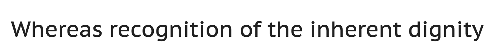
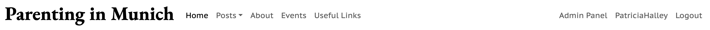
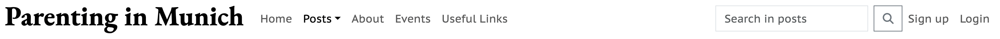
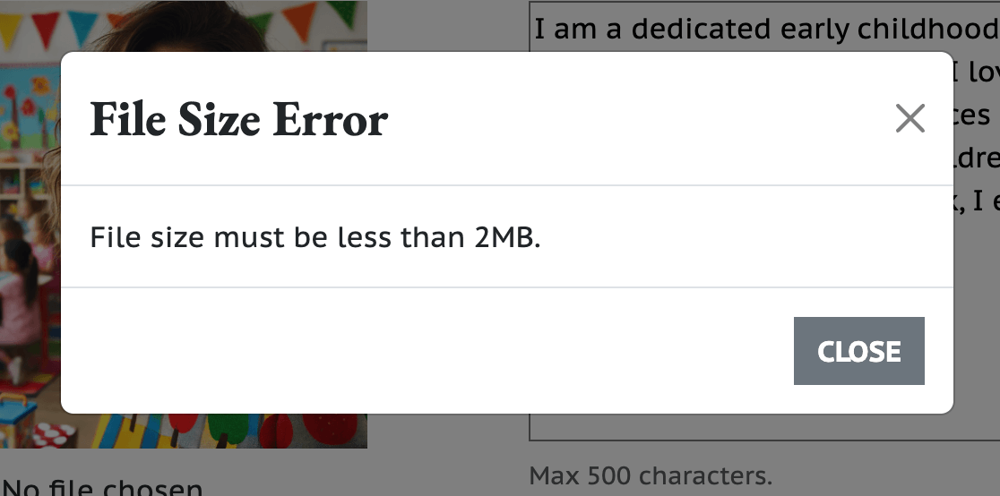

# Parenting in Munich

When I was expecting my first son as an expat in Germany, I felt lost and struggled to find information. Without family nearby, I relied on advice from others and spent a lot of time searching for resources. Thankfully, I connected with other mums in similar situations, and together, we formed a community to support each other by exchanging information.

Inspired by this experience, I created this website to provide the useful information I wished I had as a new parent in Munich. "Parenting in Munich" is designed to help new and expecting parents with parenting tips, health, education, and bureaucratic information.

Visit ythe deployed site [Parenting in Munich](https://parenting-in-munich-site-527d6bb8b97c.herokuapp.com/)

---

## Contents

- [Parenting in Munich](#parenting-in-munich)
  - [Contents](#contents)
  - [Project Objectives](#project-objectives)
  - [User Experience - UX](#user-experience---ux)
    - [Target Audience](#target-audience)
    - [User Stories](#user-stories)
      - [New Visitors Goals](#new-visitors-goals)
      - [Existing Visitors Goals](#existing-visitors-goals)
  - [Design planning](#design-planning)
    - [Wireframes](#wireframes)
    - [Entity–relationship model (ERDs)](#entityrelationship-model-erds)
      - [Simple interaction diagram](#simple-interaction-diagram)
    - [Database Plan](#database-plan)
  - [Design Choices](#design-choices)
    - [Layout](#layout)
    - [Colour Scheme](#colour-scheme)
    - [Typography](#typography)
  - [Features](#features)
    - [Existing Features](#existing-features)
      - [Home Page](#home-page)
        - [Hero Section](#hero-section)
      - [Navigation Menu](#navigation-menu)
    - [Posts and Posts by category pages](#posts-and-posts-by-category-pages)
      - [Content Display](#content-display)
      - [Search feature:](#search-feature)
      - [Responsive Design:](#responsive-design)
      - [Pagination:](#pagination)
    - [Post Detail Page](#post-detail-page)
      - [Link to Category](#link-to-category)
      - [Comments Section](#comments-section)
        - [Comments from deleted accounts](#comments-from-deleted-accounts)
      - [Comments deletion](#comments-deletion)
    - [About Us Page](#about-us-page)
      - [Contact Us Section](#contact-us-section)
    - [Events Page](#events-page)
      - [Content Display](#content-display-1)
    - [Useful Links](#useful-links)
      - [Responsive Design](#responsive-design-1)
    - [User Profile Page](#user-profile-page)
      - [Toggle Button:](#toggle-button)
      - [Delete account confirmation:](#delete-account-confirmation)
    - [Update Profile Page](#update-profile-page)
      - [Display Email:](#display-email)
      - [Profile Photo:](#profile-photo)
      - [Location](#location)
      - [Bio](#bio)
    - [Signup page](#signup-page)
    - [Login page](#login-page)
    - [Logout page](#logout-page)
    - [Site rules](#site-rules)
    - [Validation of Entries](#validation-of-entries)
      - [Restricted Area](#restricted-area)
    - [404, 403 and 500 Error Pages](#404-403-and-500-error-pages)
    - [Future Features](#future-features)
    - [Features That Will Not Be Implemented](#features-that-will-not-be-implemented)
  - [Testing](#testing)
  - [Technologies Used](#technologies-used)
    - [Languages Used](#languages-used)
    - [Frameworks, Libraries \& Programs Used](#frameworks-libraries--programs-used)
  - [Agile methodology](#agile-methodology)
  - [Deployment and Local deployment:](#deployment-and-local-deployment)
    - [Deployment](#deployment)
      - [Heroku](#heroku)
    - [Local Deployment](#local-deployment)
      - [How to Fork](#how-to-fork)
      - [How to Clone](#how-to-clone)
  - [Credits](#credits)
  - [Media](#media)
  - [Acknowledgments](#acknowledgments)

---

## Project Objectives

The aim of this project was to design and create a website to demonstrate the effective use of libraries and frameworks available to developers. Key objectives included:

**Create a Readable, Clean, and Responsive Front End**

- Utilized Django and Bootstrap to ensure the site is easily accessible and intuitive for users.

**Implement CRUD Functionality**

- Enabled users to create, update and delete profiles and comments on blog posts using Django's backend capabilities.

**Store Data on an External Cloud Database**

- Used Code Institute Postgres Database server to manage the PostgreSQL database, ensuring reliable and scalable data storage.

---

## User Experience - UX

### Target Audience

Parenting in Munich is a website designed for individuals seeking advice and resources on parenting, pregnancy, and early childhood. It serves families who have recently moved to Munich, offering information and support to help them navigate local services and cultural practices. Additionally, Munich-based parents interested in community events, parenting tips, and connecting with other families will find valuable content. The main target audience includes expecting parents, expat families, and local parents.

### User Stories

#### New Visitors Goals

As a new visitor, I expect to:

- Easily navigate the website.
- Quickly understand the website's purpose and target audience.
- Sign up and access exclusive content effortlessly.
- Easily find and read the website policies.
- Contact the website moderators without difficulty.

#### Existing Visitors Goals

As a user, I expect to:

- Manage my profile information, including my bio and profile picture, to keep my account current.
- Connect with other parents through comments on posts to share experiences and seek advice.
- Edit and delete my comments as needed.
- Access exclusive content offered by the website, such as information on local events.
- Permanently terminate my account if I choose to.

---

## Design planning

### Wireframes

The following wireframes provide a visual representation of the "Parenting in Munich" website's layout and structure during the planning phase.

These wireframes served as a blueprint for the design and functionality of each page.

- Home page
  

- Posts page
  

- Posts detail page
  

- Profile page
  

- Events page
  

- Links page
  

- About page
  

### Entity–relationship model (ERDs)

#### Simple interaction diagram

The interaction diagram below illustrates the roles and permissions on the website:

- Visitors can read posts and useful links.
- Logged-in users in addition to reading posts and useful links, also have access to the posts comments and events section. They also can create, edit, and delete their profiles and comments.
- Admins have full control to create, edit, or delete any user profiles, posts, comments, events, and useful links.

This structure ensures that visitors have limited access, users have interactive capabilities, and admins have comprehensive control over the website's content and interactions.

Simple interaction diagram

### Database Plan

The comprehensive database schema below depicts details about the type of data stored and the relationships between different entities.

---

## Design Choices

### Layout

The website's layout was inspired on the [Bootstrap Theme Milo](https://themes.getbootstrap.com/product/milo-magazineblog-theme/), and this layout was consistently applied throughout the entire site ensuring a cohesive and professional appearance, enhancing user experience and navigation.

### Colour Scheme

The chosen color palette is a monochromatic scheme designed to create a visually appealing and user-friendly interface while ensuring compatibility with the diverse images featured in the blog posts. The white (#fff) and off-white background (#f2f2f2) provides a clean, open canvas that promotes clarity and focus on the content. For the text, black (#000) and dark gray (#424242) have been used to ensure strong readability. These darker shades create a professional contrast against the white background, making the text stand out clearly. The choice of this monochromatic palette of neutral colors avoids any clash with the varied imagery on the site, maintaining visual harmony and a cohesive user experience.

### Typography

- Google Fonts were utilized to import the selected fonts for use on the website.

- [PT Sans Caption](https://fonts.google.com/specimen/PT+Sans+Caption?query=PT+Sans+cap) was used for the body text whereas [EB Garamond](https://fonts.google.com/specimen/EB+Garamond?query=EB+Garamond) was used for the headings. This combination was chosen to balance aesthetic appeal and readability. EB Garamond, a serif typeface, provides a touch of elegance, making it ideal for headings. For the main content, PT Sans Caption offers a modern, clean look that ensures high legibility across various devices. Its sans-serif design contrasts well with the traditional serif of EB Garamond, creating a balanced and accessible user experience.

- As the fallback, serif was chosen for the headings as a browser-safe font, in combination with sans-serif for the body text, following the same stylistic approach as the chosen fonts.

EB Garamond example:

PT Sans Caption example:

---

## Features

### Existing Features

#### Home Page

##### Hero Section

The home page welcomes users based on their authentication status, offering different content and links accordingly:

- For admin users there is a personalized welcome message for admins and access to the admin panel.
- For authenticated users tehre is a personalized welcome message and links to explore posts and events.
- For unauthenticated users tehre is a general welcome message and a link to sign up.

Hero image with general message for visitors:

#### Navigation Menu

The navigation bar provides users with easy access to various sections of the site, ensuring a smooth and intuitive browsing experience including a responsive design with a toggle butto for small screens, enabling the collapse and expansion of the navigation menu.

The navigation bar includes:

- A clickable logo that redirects to the home page.
- Navigation links (highlighted when active) to:
  - Home: navigation link to the home page
  - Posts: dropdown menu listing all categories as well as a direct link to all posts.
  - About: link to the About page.
  - Events: link to the Events page.
  - Useful links: direct link to the Useful Links page.
  - Authentication Links:
    - For logged-in users:
      - Admin Panel (displayed only for admin users): Link to the admin panel for staff.
      - Profile: Link to the user's profile page.
      - Logout: Link to log out.
    - For logged-out users:
      - Sign Up: Link to the sign-up page.
      - Login: Link to the login page.

Navbar view for general visitors:

Navbar view for admin users:

Navbar view for authenticated users with no admin rights:

**Search Functionality**

Because the search engine is specifically designed for finding posts, the search field is only displayed on the Posts page.

Navbar view for visitors on the posts page:

---

### Posts and Posts by category pages

Both pages allow users to browse, search, and explore various articles on parenting topics. They dynamically display posts based on user searches and include pagination for easy navigation.

All details are added through the admin panel, where they can be easily managed and updated.

#### Content Display

**Post Cards:**

- Each post is displayed in a card format with the following elements:
  - **Category Link:** Displays the category of the post, linking to other posts in the same category.
  - **Title:** Clickable link to the full post details.
  - **Featured Image:** Displays the post's featured image or a placeholder if none is provided.
  - **Excerpt:** A brief summary of the post content.

#### Search feature:

Searches for posts containig the entered word and displays the result message "Search results for [word of interest]" or display a message informing the user that no posts have matched the search query and provides a link to return to all posts.

Search results without a match:

Search results with matching results:

#### Responsive Design:

The post cards are dynamically generated and displayed 6 per page. Because the cards have different sizes, on medium and large screens, they are arranged in organized columns and rows. The default layout creates a new column every two posts, allowing them to stack on top of each other and giving the page a sense of continuity rather than a fixed grid. If there are up to three posts, they will be displayed side by side for a better user experience. The width of the columns remains 1/3, even if there are only one or two posts, to maintain consistency between different pages.

Content display:

#### Pagination:

If there are more than 6 posts to be displayed, pagination navigation controls are included, allowing users to navigate between pages of posts.

The pagination changes dynamically, showing page numbers within a range around the current page, along with links to the previous and next pages of posts, and direct links to the first and last pages when appropriate.

On small screens, such as mobile phones, the pagination omits the buttons for the previous and next pages to better accommodate the controls on the limited screen size while still allowing easy navigation throughout the entire content.

Pagination Comparison: Computer Screen vs. Phone Screen:

---

### Post Detail Page

The Post Detail page displays the full content of a specific post, along with a comment section for user interactions.

#### Link to Category

On the post detail page, a link to the post's category is provided. When clicked, this link takes the user directly to the category page, which includes other posts in that same category.

Link to category:

#### Comments Section

The comments section displays the number of comments and allows authenticated users to submit comments.

- Authenticated users can see all approved comments and see, delete or edit their own comments, even the pending aproval ones.
- Approved comments have a link to the comment's author profile.
- Unauthenticated users are prompt to log in or sign up to participate in discussions.

##### Comments from deleted accounts

If a user has left a comment and deleted their account or had their account deleted, their comments will remain on the posts unless they themselves deleted the comments, or the comments were not approved or were deleted for inappropriate content. In such cases, the username will be followed by a "Deactivated" mention to indicate that the user is no longer a registered member of the website, thus preserving the integrity of the history and discussions. There will be no link to the profile, and the profile photo thumbnail will be displayed with a fainted image of the placeholder image for the profile.

The reasoning for keeping comments upon account termination is explained in the website rules that users must agree to upon signing up. This information is also explicitly provided when a user terminates their account.

Comment's author view of the comments with edit and delete options:

Overview of the comments section including comment from deleted account's author:

#### Comments deletion

Users can delete their own comments and will be asked to confirm their decision before the permanent deletion.

Confirmation prior to deletion:

### About Us Page

The "About Us" page provides information about the website, its mission, and a way for users to get in touch.

The information about the website and the image displayed on the page can be managed and updated through the admin pannel.

#### Contact Us Section

Users are invited to reach out with feedback, questions, or suggestions

### Events Page

The Events page is exclusively for registered users and showcases upcoming family-oriented events, providing detailed information about each event.
Just like with the posts, all details are added through the admin panel, where they can be easily managed and updated.

#### Content Display

The events are displayed in a similar way to the posts to keep consistancy thoughout the website.

- Event Card Structure:
  - Event Image: Displays the event's image.
  - Event Name: Title of the event.
  - Description: Detailed information about the event.
  - Location: Venue of the event.
  - Date: Start and end dates of the event.
  - Time: Start and end times of the event. If only start time is provided, the time is displayed as "from 'hours'"
  - Website Link: (Optional) Link to the event's website.

The page is programmed to order the events by start date, displaying the closest ones first. It also automatically filters out events that have an end date earlier than the current date.

Events page layout:

- The content observed on the live site may differ due to the filtering passed events feature. Screenshot taken on June 22nd 2024

If there are no events to be displayed the page, a friendly iamge and message are displayed.

If tehre are no events to be displayed:

### Useful Links

Curated list of websites and resources beneficial for parents, organized by topic and displayed in a card format.

#### Responsive Design

The links are added using the admin panel and are associated with a specific topic. When the page is rendered, the links are automatically displayed under the corresponding topic, organized alphabetically for an intuitive user experience. The links are programmed to open in a new tab.

### User Profile Page

The User Profile page allows users to view and update their profile information, such as name, e-mail, location, bio, and profile photo as well as manage their account and their comments.

#### Toggle Button:

The "View My Comments" button to show and hide the list of comments left by the user with the link to the respective comments on the respective post so that the user can easily manage their comments.

Profile view by account owner:

Registered users can also view other users' profiles by clicking on the link of a post's comment, for instance. Profile views by other registered users are limited to viewing only, with no option to edit or delete the profile information.

Profile view by other registered user:

#### Delete account confirmation:

The confirmation ensures that the user is aware of the permanence of the action and reminds the user that their comments will remain on the website unless they delete their comments themselves.

Delete account confirmation:

### Update Profile Page

The Update Profile page allows users to edit their personal information, including their full name, email, bio, location, and profile photo.

#### Display Email:

The user can decide if they want to display their e-mail publicly or not by checking or unchecking the checkbox on the "update profile" page.

#### Profile Photo:

The users can choose a photo of up to 2MB to upload as their profile photo. This photo is then automatically converted to webp by using the [Python Imaging Library (PIL)](https://pypi.org/project/pillow/) and stored on the [Cloudinary website](https://cloudinary.com/users/register_free).

If the selected image is larger than 2MB there is a popup window warning about the size limit.

Size limit warning:

The users can preview the photo they are choosing in realtime, without the need to update the page to see their profile photo. They can also delete their photo, in which case a placeholder image will be displayed as their profile photo.

#### Location

The users can choose their location from a list of districts in Munich. They are also provided with the option "Other". If "Other" is selected, they are provided with an optional field to type in their location.

#### Bio

The text area for the bio is limited to 500 characters, and this limit is displayed to the user on the update profile page beneath the Bio text area.

Overview of the update profile page with all the described features:

### Signup page

### Login page

### Logout page

When users choose to log out, they are asked to confirm their action. Upon confirmation, a thank you message is displayed, acknowledging their visit.

Logout page:

Thank you message:

### Site rules

The website includes a page with the site rules. The link for this page is both included on the footer of the page (as "Policy") and on the signup page. On the signup page, the link opens in a new window in order not to disturb the ongoing signing up process for a better user experience.

### Validation of Entries

Validation has been implemented to avoid duplication of categories, posts, topics (for the useful links section), and events.

- Categories: The system checks for duplicate category names.
- Posts: The system checks for duplicate post titles.
- Topics: The system checks for duplicate topics in the useful links section.
- Events: The system checks for duplicate events based on the combination of name, location, description, and dates.
- When the admin creates a new record, the system verifies if it already exists in the database. If a duplicate is found, the record is not added, and a message is displayed stating that the specific item already exists.

#### Restricted Area

Unauthorized users are promt to register in order to see the content.

### 404, 403 and 500 Error Pages

Custom user-friendly 404 Page not Found, 403 Forbidden and 500 Internal Server Error appear if a page is not found, a user tries to access a restricted resource and the server encounters an unexpected condition that prevents it from fulfilling the request respectivelly. The user is then prompted to return to the main page by either clicking on a provided link or the image itself, ensuring a smooth and intuitive user experience.

- 404 Page not Found:
  

- 403 Forbidden:
  

- 500 Internal Server Error
  

### Future Features

- Implement a filter for images and content to ensure no offensive or inappropriate images or messages are uploaded in profiles and comments.
- Add the capability for users to flag content for review by site admins.
- Introduce a discussion forum section where users can share experiences and ask questions.
- Add interactive maps showing family-friendly places in Munich, such as playgrounds, parks, and hospitals.
- Provide multilingual support to cater to a diverse expat community.

### Features That Will Not Be Implemented

Initially, there was a plan for users to enter events and decide if those events would be private or public. If the event was private, users would be able to invite other users, and only those invited would have visibility to those events. This feature is no longer going to be implemented for security and liability reasons. Events can only be added and managed by users with admin privileges.

---

## Testing

Please refer to [TESTING.md](TESTING.md) file for details on all testing conducted.

---

## Technologies Used

### Languages Used

- HTML, CSS, Pyhton and JavaScript

### Frameworks, Libraries & Programs Used

- [Django](https://www.djangoproject.com/) To build the website.
- [Bootstrap](https://getbootstrap.com/) Used in addition to CSS to style the website and make it responsive.
- [Coolors](https://coolors.co/) To generate the color palette.
- [Balsamiq](https://balsamiq.com/) To create wireframes.
- [Github](https://github.com/) To save and store the files for the website.
- [Google Fonts](https://fonts.google.com/) To import the fonts used on the website.
- [Google Developer Tools](https://developers.google.com/web/tools) - To troubleshoot and test features, solve issues with responsiveness and styling.
- [TinyPNG](https://tinypng.com/) To optimize png and jpg images.
- [Sqoosh app](https://squoosh.app/) To optimize and convert images to webp format.
- [Favicon.io](https://favicon.io/) To create favicon.
- [Am I Responsive?](http://ami.responsivedesign.is/) To diplay the website image on a range of devices.
- [VSCode](https://code.visualstudio.com/) To edit and save my code locally.
- [PEP8 Validator](https://pep8ci.herokuapp.com/) Used to check python code for errors.
- [W3C](https://validator.w3.org/) Used to validate the HTML on all pages of the website.
- [(Jigsaw) validator](https://jigsaw.w3.org/css-validator/) Used to validate the CSS.
- [PostgreSQL from Code Institute](https://dbs.ci-dbs.net/) Used to store PostgreSQL database.
- [Cloudinary](https://cloudinary.com/) Used as cloud storage for images uploaded as part of the blog posts as for the users profile photos.
- [Heroku](https://id.heroku.com/) Used to deploy the project.
- [Webpage Spell-Check](https://chrome.google.com/webstore/detail/webpage-spell-check/mgdhaoimpabdhmacaclbbjddhngchjik/related) A google chrome extension that allows you to spell check your webpage. Used to check the site and the readme for spelling errors.

---

## Agile methodology

This project was designed using Agile methodology, utilizing the Project Board and Issues sections in GitHub.

- [Project Board](https://github.com/users/pswhdev/projects/5)

---

## Deployment and Local deployment:

### Deployment

#### Heroku

The Application has been deployed from GitHub to Heroku by following the steps:

1. Create or log in to your account at heroku.com
2. Create a new app, add a unique app name and then choose your region
3. Click on create app
4. Go to "Settings"
5. Under Config Vars add the relevant Vars. For this project, I needed to add CLOUDINARY_URL, DATABASE_URL and SECRET_KEY.
6. Go to "Deploy" and select "GitHub" in "Deployment method"
7. To connect Heroku app to your Github repository code enter your repository name, click 'Search' and then 'Connect' once it is found.
8. Choose the branch you want to build your app from
9. Either choose to deploy manually by clicking "Deploy Branch" or click on "Enable Automatic Deploys", which keeps the app up to date with your GitHub repository
10. Wait for the app to build. Once ready you will see the “App was successfully deployed” message and a 'View' button to take you to your deployed link.

The live link can be found here - [Parenting in Munich](https://parenting-in-munich-site-527d6bb8b97c.herokuapp.com/)

### Local Deployment

#### How to Fork

To fork the repository:

- Log in (or sign up) to Github.
- Go to the repository for this project, [pswhdev/parenting_in_munich](https://github.com/pswhdev/parenting_in_munich)
- Click the Fork button in the top right corner.

#### How to Clone

To clone the repository:

- Log in (or sign up) to GitHub.
- Go to the repository for this project, [pswhdev/parenting_in_munich](https://github.com/pswhdev/parenting_in_munich)
- Click on the code button, select whether you would like to clone with HTTPS, SSH or GitHub CLI and copy the link shown.
- Open the terminal in your code editor and change the current working directory to the location you want to use for the cloned directory.
- Type 'git clone' into the terminal and then paste the link you copied from the repository. Press enter.

---

## Credits

This project builds upon the Code Institute's "I Think Therefore I Blog" walkthrough module, which provided a foundational blog structure for the website. From this base, I added a custom model for Category, enabling users to filter posts by category. I further expanded the project by creating additional apps (events, account, useful links), models, views, and forms. Additionally, I customized the layout and styling using Bootstrap and custom CSS. I also drew inspiration from the [YouTube Django Recipe Sharing Tutorial by Dee Mc](https://www.youtube.com/watch?v=sBjbty691eI&list=PLXuTq6OsqZjbCSfiLNb2f1FOs8viArjWy), which provides a clear and educational guide on creating a website using Django and Bootstrap.

All text content for the posts was created with the assistance of AI for educational purposes only, and it was not verified for accuracy.

The Readme was based on the example by [Kera Cudmore - Readme Examples](https://github.com/kera-cudmore/readme-examples/blob/main/README.md?plain=1) and [Mark Daniel - My Fishing Adventures](https://github.com/markdaniel1982/MD82-P4/blob/main/README.md)

---

## Media

All the images used on the website are free of copyrights and are credited directly on the webpages, except for the images on the homepage ([Photo by Jay Chen on Unsplash](https://unsplash.com/@forhiskingdom?utm_content=creditCopyText&utm_medium=referral&utm_source=unsplash)), the about page([Photo by Lora Moore-Kakaletris on Unsplash](https://unsplash.com/@mooreimages?utm_content=creditCopyText&utm_medium=referral&utm_source=unsplash)) and the logout page (sourced from [Pickpik](https://www.pickpik.com/boys-playing-friends-children-playing-kids-playing-happy-2351)). The images for the restricted area, no posts found, and 404 error pages were generated using OpenAI's DALL-E technology.

---

## Acknowledgments

I would like to express my gratitude to:

- My family and friends for testing the website and giving feedback.
- My Cohort Facilitator Kristyna Wach as well as my fellow Code Institute students who have provided great support.
- Jubril Akolade, my mentor, for providing his support and guidance.
