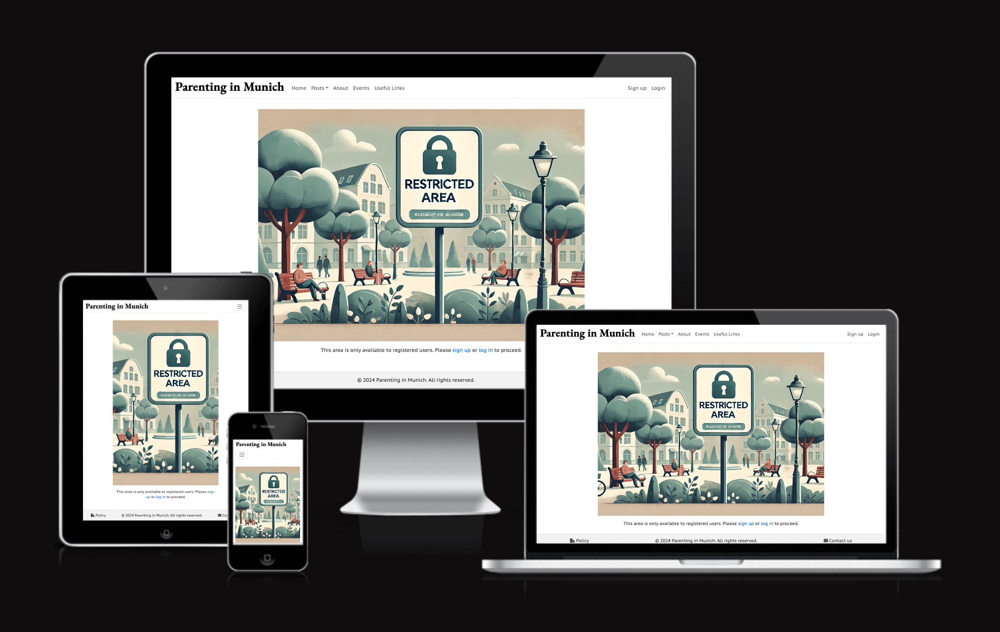

# Testing

## Contents

- [Testing](#testing)
  - [Contents](#contents)
  - [Code Style and Quality](#code-style-and-quality)
    - [Python Enhancement Proposal (PEP8)](#python-enhancement-proposal-pep8)
    - [HTML Validation tests](#html-validation-tests)
    - [CSS validation was done using W3C CSS Validator](#css-validation-was-done-using-w3c-css-validator)
  - [Lighthouse tests results:](#lighthouse-tests-results)
  - [Responsiveness test:](#responsiveness-test)
  - [Testing User Stories](#testing-user-stories)
    - [New Visitors Goals](#new-visitors-goals)
    - [Existing Visitors Goals](#existing-visitors-goals)
  - [Full Testing](#full-testing)
    - [Naviagtion Menu](#naviagtion-menu)
    - [Homepage](#homepage)
  - [| Join Us Link                       | Navigate to the Home page without logging in, click on the "Join us!" link.         | User is redirected to the Sign up page.                                                                   | Works as expected  |](#-join-us-link------------------------navigate-to-the-home-page-without-logging-in-click-on-the-join-us-link----------user-is-redirected-to-the-sign-up-page--------------------------------------------------------------------works-as-expected--)
    - [Posts Page](#posts-page)
    - [Posts Category Page](#posts-category-page)
  - [| Pagination           | Same as pagination tests for Posts page                                | Same expected results as for pagination tests for the Posts page  | Works as expected  |](#-pagination------------same-as-pagination-tests-for-posts-page---------------------------------same-expected-results-as-for-pagination-tests-for-the-posts-page---works-as-expected--)
    - [Post Detail Page](#post-detail-page)
  - [| Login Message for Comments  | Navigate to a post detail page without logging in.                                  | A message prompting the user to log in or sign up to participate in the discussion is displayed.          | Works as expected  |](#-login-message-for-comments---navigate-to-a-post-detail-page-without-logging-in-----------------------------------a-message-prompting-the-user-to-log-in-or-sign-up-to-participate-in-the-discussion-is-displayed-----------works-as-expected--)
    - [About Page](#about-page)
    - [Events Page](#events-page)
  - [Known bug](#known-bug)
  - [Back to README](#back-to-readme)

---

## Code Style and Quality

### Python Enhancement Proposal (PEP8)

PEP8 outlines the conventions for writing clean, readable, and maintainable Python code. Adhering to these guidelines helps ensure that the codebase remains consistent and understandable for all contributors.
All Python code in this project has been checked and verified for adherence to the PEP8 style guide using the extension [Flake8](https://flake8.pycqa.org/en/latest/) on [VSCode](https://code.visualstudio.com/) and double checked using the [CI PEP8 linter](https://pep8ci.herokuapp.com/).

### HTML Validation tests

HTML Validation tests were performed using the [W3C Markup validation service](https://validator.w3.org/#validate_by_uri):

- [Homepage](https://validator.w3.org/nu/?doc=https%3A%2F%2Fparenting-in-munich-site-527d6bb8b97c.herokuapp.com%2F)
- [Posts All Categories](https://validator.w3.org/nu/?doc=https%3A%2F%2Fparenting-in-munich-site-527d6bb8b97c.herokuapp.com%2Fposts%2F)
- [Post Specific Category - Pregnancy and Birth](https://validator.w3.org/nu/?doc=https%3A%2F%2Fparenting-in-munich-site-527d6bb8b97c.herokuapp.com%2Fposts%2Fcategory%2Fpregnancy-and-birth%2F)
- [Post Specific Category - Parenting Advice](https://validator.w3.org/nu/?doc=https%3A%2F%2Fparenting-in-munich-site-527d6bb8b97c.herokuapp.com%2Fposts%2Fcategory%2Fparenting-advice%2F)
- [Post Specific Category - Nutrition](https://validator.w3.org/nu/?doc=https%3A%2F%2Fparenting-in-munich-site-527d6bb8b97c.herokuapp.com%2Fposts%2Fcategory%2Fnutrition%2F)
- [Post Specific Category - Education and Development](https://validator.w3.org/nu/?doc=https%3A%2F%2Fparenting-in-munich-site-527d6bb8b97c.herokuapp.com%2Fposts%2Fcategory%2Feducation-and-development%2F)
- [Post Specific Category - Cultural Traditions](https://validator.w3.org/nu/?doc=https%3A%2F%2Fparenting-in-munich-site-527d6bb8b97c.herokuapp.com%2Fposts%2Fcategory%2Fcultural-traditions%2F)
- [Post Specific Category - Bullying](https://validator.w3.org/nu/?doc=https%3A%2F%2Fparenting-in-munich-site-527d6bb8b97c.herokuapp.com%2Fposts%2Fcategory%2Fbullying%2F)
- [Post Specific Category - Childcare](https://validator.w3.org/nu/?doc=https%3A%2F%2Fparenting-in-munich-site-527d6bb8b97c.herokuapp.com%2Fposts%2Fcategory%2Fchildcare%2F)
- [Post Specific Category - Legal and Administrative Processes](https://validator.w3.org/nu/?doc=https%3A%2F%2Fparenting-in-munich-site-527d6bb8b97c.herokuapp.com%2Fposts%2Fcategory%2Flegal-and-administrative-processes%2F)
- [Post Specific Category - Healthcare](https://validator.w3.org/nu/?doc=https%3A%2F%2Fparenting-in-munich-site-527d6bb8b97c.herokuapp.com%2Fposts%2Fcategory%2Fhealthcare%2F)
- [Post Detail - Specific Post](https://validator.w3.org/nu/?doc=https%3A%2F%2Fparenting-in-munich-site-527d6bb8b97c.herokuapp.com%2Fposts%2Fdo-pregnant-women-and-new-mothers-need-a-hebamme-exploring-the-role-of-midwives-in-germany%2F)
- [About page](https://validator.w3.org/nu/?doc=https%3A%2F%2Fparenting-in-munich-site-527d6bb8b97c.herokuapp.com%2Fabout%2F)
- [Events page](https://validator.w3.org/nu/?doc=https%3A%2F%2Fparenting-in-munich-site-527d6bb8b97c.herokuapp.com%2Fevents%2F)
- [Useful links](https://validator.w3.org/nu/?showsource=yes&doc=https%3A%2F%2Fparenting-in-munich-site-527d6bb8b97c.herokuapp.com%2Fuseful_links%2F)
- [Login page](https://validator.w3.org/nu/?showsource=yes&doc=https%3A%2F%2Fparenting-in-munich-site-527d6bb8b97c.herokuapp.com%2Faccounts%2Flogin%2F)
- [Signup page](https://validator.w3.org/nu/?showsource=yes&doc=https%3A%2F%2Fparenting-in-munich-site-527d6bb8b97c.herokuapp.com%2Faccounts%2Fsignup%2F)
- [Logout page](https://validator.w3.org/nu/?showsource=yes&doc=https%3A%2F%2Fparenting-in-munich-site-527d6bb8b97c.herokuapp.com%2Faccounts%2Flogout%2F)

**Notes**

- All 7 pages of Posts (All Categories) were tested. I only included the results of page 1 here for illustration purpose.

- All 37 posts were individually tested, I have only included the result for the test on the "Do Pregnant Women and New Mothers Need a Hebamme? Exploring the Role of Midwives in Germany" here for illustration purpose.

- All pages with authenticated user and page 404 were tested by pasting the source code from the rendered page and also passed with no error nor warnings.

---

### CSS validation was done using [W3C CSS Validator](https://jigsaw.w3.org/css-validator/)

- [CSS validation](https://jigsaw.w3.org/css-validator/validator?uri=https%3A%2F%2Fparenting-in-munich-site-527d6bb8b97c.herokuapp.com%2F&profile=css3svg&usermedium=all&warning=1&vextwarning=&lang=enn)

---

## Lighthouse tests results:

Performance, accessibility, SEO, and best practices were evaluated using Google's Lighthouse tool. The results for each page are included below. Results with a white background represent mobile audits, while those with a black background represent desktop audits.

- black background: desktop
- white background: mobile

- Homepage:

- Posts - All categories page:

- Post - Category specific page:

- Post detail page:

- About page:

- Events page:

- Events restricted area page:

- Useful links page:

- Signup page:

- Login page:

- User Profile page:

- Profile Update page:

- Logout page:

---

## Responsiveness test:

The resposiveness amongts different devices was checked using [Am I Responsive](https://ui.dev/amiresponsive).
To perform the testing, it was necessary to adjust the `X_FRAME_OPTIONS` to `ALLOWALL` temporarily on settings.py and change back to `SAMEORIGIN` as soon as the test was finished for security reasons.

- Homepage:

- Posts page:

- Post category page:

- Post detail page:

- About page:

- Restricted area page:

- Useful links page:

- Signup page:

- Login page:

- Site rules page:

- The Events, User Profile, Profile Update and Logout pages could not be tested on the website because the login doesn't work during the testing, but they were manually tested in different devices and are responsive as well.

---

## Testing User Stories

### New Visitors Goals

As a new visitor, I expect to:

**Easily navigate the website**

- The navigation menu includes links to all sections of the website, including a dropdown for categories under "Posts" and a search engine, present in the navbar on the posts section.

**Quickly understand the website's purpose and target audience**

- There is an About page with clear information about the website's purpose and target audience.

**Sign up and access exclusive content effortlessly**

- Visitors can sign up using the navbar link, and upon creating their accounts, they have immediate access to content exclusive to registered members.

**Easily find and read the website policies**

- The link for the website policies can be easily found in the footer of all webpages as well as on the signup page.

**Contact the website moderators without difficulty**

- There is a "Contact Us" section on the About page and a link in the footer of all webpages that directs the user straight to the "Contact Us" section. In this section, the visitor can send a message by entering their name and email.

### Existing Visitors Goals

As a user, I expect to:
**Manage my profile information, including my bio and profile picture, to keep my account current**

- Users can easily manage their information, including email, bio, profile picture, and location, by clicking the Edit button on their profile page.

**Connect with other parents through comments on posts to share experiences and seek advice**

- Users can leave comments on posts and click on the usernames of other commenters to view their information, including their email (if they have chosen to display it publicly).

**Edit and delete my comments as needed**

- Users have access to all comments they have left on the website from their profile page. They can click on a comment to be redirected to the respective post and comment, where they can edit or delete their comments as desired.

**Access exclusive content offered by the website, such as information on local events**

- Registered users can view all events published on the events page.

**Permanently terminate my account if I choose to**

- Users can permanently delete their accounts at any time by clicking the Delete button on their profile page.

---

## Full Testing

### Naviagtion Menu

| Feature              | Action                                                                                        | Expected Result                                                                                                                                                                                | Actual Result     |
| -------------------- | --------------------------------------------------------------------------------------------- | ---------------------------------------------------------------------------------------------------------------------------------------------------------------------------------------------- | ----------------- |
| Logout Link          | Click on "Parenting in Munich" in the navigation bar.                                         | User is redirected to the Home page.                                                                                                                                                           | Works as expected |
| Home Link            | Click on "Home" in the navigation bar.                                                        | User is redirected to the Home page.                                                                                                                                                           | Works as expected |
| Posts Link           | Click on "Posts" in the navigation bar.                                                       | User is presented with a dropdown menu.                                                                                                                                                        | Works as expected |
| All Categories Link  | Click on "All Categories" under the "Posts" dropdown menu.                                    | User is redirected to the Posts page, displaying all posts.                                                                                                                                    | Works as expected |
| Category Posts Link  | Click on "Posts" in the navigation bar, then click on a specific category.                    | User is redirected to the selected category posts page, displaying relevant posts.                                                                                                             | Works as expected |
| About Link           | Click on "About" in the navigation bar.                                                       | User is redirected to the About page, displaying information about the website.                                                                                                                | Works as expected |
| Events Link          | Click on "Events" in the navigation bar.                                                      | If logged in, user is redirected to the Events page, displaying upcoming events. If not logged in, user is redirected to the Restricted Area page.                                             | Works as expected |
| Useful Links         | Click on "Useful Links" in the navigation bar.                                                | User is redirected to the Useful Links page, displaying a list of useful resources.                                                                                                            | Works as expected |
| Sign Up Link         | Click on "Sign up" in the navigation bar.                                                     | User is redirected to the Sign up page, displaying the registration form.                                                                                                                      | Works as expected |
| Login Link           | Click on "Login" in the navigation bar.                                                       | User is redirected to the Login page, displaying the login form.                                                                                                                               | Works as expected |
| Logout Link          | Log in to the website, then click on "Logout" in the navigation bar.                          | User is logged out and redirected to the Home page.                                                                                                                                            | Works as expected |
| Profile Link         | Log in to the website, then click on the profile link in the navigation bar (users username). | User is redirected to their Profile page, displaying user information.                                                                                                                         | Works as expected |
| Admin Panel Link     | Log in as an admin, then click on the "Admin Panel" link in the navigation bar.               | Admin user is redirected to the Admin Panel.                                                                                                                                                   | Works as expected |
| Search Functionality | Navigate to the "Posts" page, enter a keyword in the search bar, and submit the query.        | If there are matching results, the search results page displays relevant posts. If no matches are found, a friendly image and message prompt users to try a new search or return to all posts. | Works as expected |

---

### Homepage

| Feature                            | Action                                                                             | Expected Result                                                                                           | Actual Result      |
|------------------------------------|------------------------------------------------------------------------------------|-----------------------------------------------------------------------------------------------------------|--------------------|
| Admin Welcome Message              | Log in as an admin and navigate to the Home page.                                   | Admin sees a welcome message with their username and a link to the Admin Panel.                           | Works as expected  |
| Admin Panel Link                   | Log in as an admin, click on the "Go to Admin Panel" link.                          | Admin is redirected to the Admin Panel page.                                                              | Works as expected  |
| Authenticated User Welcome Message | Log in as a regular user and navigate to the Home page.                             | User sees a welcome message with their username and links to Posts and Events.                            | Works as expected  |
| See Posts Link                     | Log in as a regular user, click on the "See Posts" link.                            | User is redirected to the Posts page.                                                                     | Works as expected  |
| See Events Link                    | Log in as a regular user, click on the "See Events" link.                           | User is redirected to the Events page.                                                                    | Works as expected  |
| Unauthenticated User Welcome Message | Navigate to the Home page without logging in.                                      | User sees a welcome message and a link to join the website.                                               | Works as expected  |
| Join Us Link                       | Navigate to the Home page without logging in, click on the "Join us!" link.         | User is redirected to the Sign up page.                                                                   | Works as expected  |
---

### Posts Page

| Feature                      | Action                                                                 | Expected Result                                                                                         | Actual Result      |
|------------------------------|------------------------------------------------------------------------|---------------------------------------------------------------------------------------------------------|--------------------|
| All Posts Header             | Navigate to the Posts page without performing a search.                | The header displays "Posts".                                                                            | Works as expected  |
| Search Results Header        | Perform a search using the search bar.                                 | The header displays "Search results for 'search_query'".                                                | Works as expected  |
| Search Results with match    | Perform a search that yields results.                                  | All posts containing the search_query are displayed on the page                                         | Works as expected  |
| Search Results with no match | Perform a search that yields no results.                               | A "No posts found" image and message are displayed.                                                     | Works as expected  |
| Post Category Link           | Click on a post category link from the post card.                      | User is redirected to the selected category page.                                                       | Works as expected  |
| Post Title Link              | Click on a post title link.                                            | User is redirected to the post detail page.                                                             | Works as expected  |
| Placeholder Image            | Verify a post without a featured image displays a placeholder image.   | The placeholder image is displayed for the post.                                                        | Works as expected  |
| Post Featured Image          | Verify a post with a featured image displays the correct image.        | The correct featured image is displayed for the post.                                                   | Works as expected  |
| Pagination - Visible Range   | Verify the pagination displays a limited range around the current page number. | Pagination shows only the pages within a range of 3 around the current page.                             | Works as expected  |
| Pagination - Page Links      | Navigate through the page links in the pagination section.             | The correct page of posts is displayed when clicking on each page number.                               | Works as expected  |
| Pagination - First Page      | Navigate to the Posts page, ensure the first page is displayed.        | The pagination does not show "First" and "Previous" buttons.                                            | Works as expected  |
| Pagination - Middle Page     | Navigate to a middle page of the Posts.                                | The pagination displays "Previous" and "Next" buttons. When the first or last page is not within the displayed range, "First" and "Last" buttons are shown accordingly. | Works as expected  |
| Pagination - Last Page       | Navigate to the last page of the Posts.                                | The pagination does not show "Next" and "Last" buttons.                                                 | Works as expected  |

---

### Posts Category Page

| Feature              | Action                                                                 | Expected Result                                                   | Actual Result      |
|----------------------|------------------------------------------------------------------------|-------------------------------------------------------------------|--------------------|
| Page Title           | Navigate to the category page.                                         | The page title should be the name of the category.                | Works as expected  |
| Post Category Link   | Click on a post category link.                                         | User is redirected to the selected category page.                 | Works as expected  |
| Post Title Link      | Click on a post title link.                                            | User is redirected to the post detail page.                       | Works as expected  |
| Placeholder Image    | Verify a post without a featured image displays a placeholder image.   | The placeholder image is displayed for the post.                  | Works as expected  |
| Post Featured Image  | Verify a post with a featured image displays the correct image.        | The correct featured image is displayed for the post.             | Works as expected  |
| Pagination           | Same as pagination tests for Posts page                                | Same expected results as for pagination tests for the Posts page  | Works as expected  |
---

**Note** To conduct the pagination tests, a large number of test posts were created to ensure an adequate number of pages for thorough testing. These test posts were subsequently deleted upon completion of the tests.

---

### Post Detail Page

| Feature                     | Action                                                                              | Expected Result                                                                                           | Actual Result      |
|-----------------------------|-------------------------------------------------------------------------------------|-----------------------------------------------------------------------------------------------------------|--------------------|
| Page Title                  | Navigate to a post detail page.                                                     | The page title should be the title of the post.                                                           | Works as expected  |
| Placeholder Image           | Verify a post without a featured image displays a placeholder image.                | The placeholder image is displayed for the post.                                                          | Works as expected  |
| Post Featured Image         | Verify a post with a featured image displays the correct image.                     | The correct featured image is displayed for the post.                                                     | Works as expected  |
| Post Metadata               | Navigate to a post detail page.                                                     | The author, last updated date, and category are displayed below the title.                                | Works as expected  |
| Post Content                | Navigate to a post detail page.                                                     | The full post content is displayed.                                                                       | Works as expected  |
| Comments Section Header     | Navigate to a post detail page.                                                     | The comments section header displays the number of comments.                                              | Works as expected  |
| New Comment Form            | Log in and navigate to a post detail page.                                          | The new comment form is displayed, allowing the logged-in user to submit a comment.                       | Works as expected  |
| Comment Submission          | Submit a new comment as a logged-in user.                                           | The comment is displayed below the post, showing the username and content.                                | Works as expected  |
| Pending Comment Approval    | Submit a new comment as a logged-in user.                                           | The comment is displayed with a "pending approval" message.                                               | Works as expected  |
| Approved Comments           | Navigate to a post detail page with approved comments.                              | Approved comments are displayed below the post content.                                                   | Works as expected  |
| Profile Link in Comments    | Click on a comment author's profile link.                                           | User is redirected to the comment author's profile page.                                                  | Works as expected  |
| Comment Edit Button         | Navigate to a post detail page, find your comment, and click the "Edit" button.     | The comment edit form is displayed, allowing the user to edit their comment.                              | Works as expected  |
| Comment Delete Button       | Navigate to a post detail page, find your comment, and click the "Delete" button.   | A confirmation modal is displayed, allowing the user to confirm or cancel the deletion.                   | Works as expected  |
| Delete Confirmation         | Confirm the deletion of your comment.                                               | The comment is removed from the post.                                                                     | Works as expected  |
| Login Message for Comments  | Navigate to a post detail page without logging in.                                  | A message prompting the user to log in or sign up to participate in the discussion is displayed.          | Works as expected  |
---

### About Page

| Feature                   | Action                                                                                     | Expected Result                                                                                        | Actual Result      |
|---------------------------|--------------------------------------------------------------------------------------------|--------------------------------------------------------------------------------------------------------|--------------------|
| Page Title                | Navigate to the "About Us" page.                                                           | The page title should be "About Us".                                                                   | Works as expected  |
| Placeholder Image         | Verify the "About Us" page without a profile image displays a placeholder image.           | The placeholder image is displayed for the "About Us" page.                                            | Works as expected  |
| Profile Image             | Verify the "About Us" page with a profile image displays the correct image.                | The correct profile image is displayed for the "About Us" page.                                        | Works as expected  |
| Last Updated              | Navigate to the "About Us" page.                                                           | The "Last updated on" date is displayed below the image.                                               | Works as expected  |
| About Us Content          | Navigate to the "About Us" page.                                                           | The full "About Us" content is displayed.                                                              | Works as expected  |
| Contact Us Section Title  | Navigate to the "About Us" page.                                                           | The "We'd Love to Hear from You!" title is displayed in the Contact Us section.                        | Works as expected  |
| Contact Us Section Text   | Navigate to the "About Us" page.                                                           | The Contact Us section text is displayed, explaining the purpose of the form.                          | Works as expected  |
| Contact Us Form           | Navigate to the "About Us" page.                                                           | The Contact Us form is displayed, allowing the user to submit messages to the admins.                  | Works as expected  |
| Submit Contact Form       | Fill out and submit the Contact Us form.                                                   | The form is successfully submitted, and a confirmation message is displayed.                           | Works as expected  |

---

### Events Page

---
## Known bug

**Description:**

When a user tries to access a restricted area, they are prompted to log in or sign up. If the user logs in, they are correctly redirected to the page they were trying to visit. However, if the user is not registered and chooses to sign up, they are redirected to the homepage after successfully signing up.

**Cause:**

This issue is due to the default behavior of Django's allauth authentication views. Attempts to override this behavior have been unsuccessful so far.

---

## Back to README

Go [Back to README](README.md)

---
